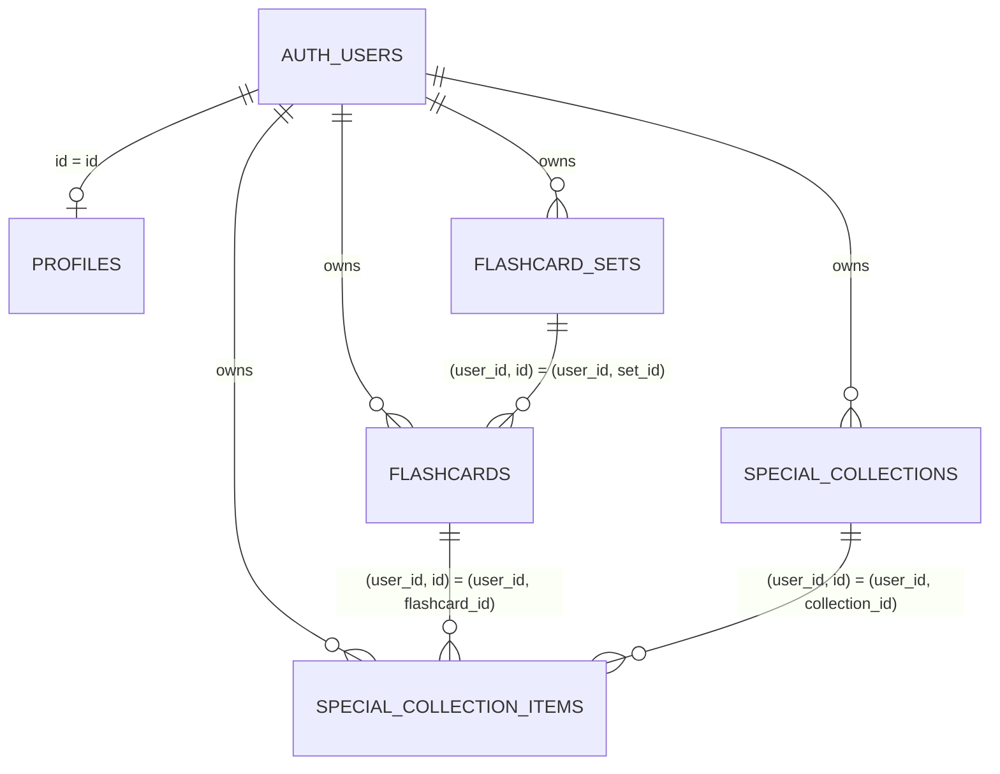

# Database

## Overview

FlashLearn uses Supabase (PostgreSQL 15) as its database. This document describes the
foundation schema, its constraints, indexes, triggers and row-level security policies.

The core foundation intentionally covers only data ownership: `profiles`,
`flashcard_sets`, `flashcards`, `special_collections` and `special_collection_items`.
Quiz attempts, learning statistics and streak tables are added in later phases.

## ERD



## Schemas

| Table                      | Purpose                                        |
| -------------------------- | ---------------------------------------------- |
| `profiles`                 | Per-user profile, one row per Auth user        |
| `flashcard_sets`           | Regular flashcard sets (one per import)        |
| `flashcards`               | Flashcard rows owned by a user within a set    |
| `special_collections`      | User-created collections that group flashcards |
| `special_collection_items` | Membership link between a collection and card  |

## Tables

### `public.profiles`

| Column                | Type          | Default              | Notes                                       |
| --------------------- | ------------- | -------------------- | ------------------------------------------- |
| `id`                  | `uuid`        | —                    | PK, FK → `auth.users(id)` ON DELETE CASCADE |
| `display_name`        | `text`        | —                    | NULL if blank; max 100 chars                |
| `avatar_url`          | `text`        | —                    | max 500 chars                               |
| `timezone`            | `text`        | `'Asia/Ho_Chi_Minh'` | max 64 chars                                |
| `timezone_changed_at` | `timestamptz` | —                    | server-written 72-hour cooldown timestamp   |
| `created_at`          | `timestamptz` | `now()`              |                                             |
| `updated_at`          | `timestamptz` | `now()`              | refreshed by trigger                        |

Rows are created only by the `handle_new_user` trigger (one per Auth user). There is no
public INSERT policy, so users cannot create a profile for another Auth user.

### `public.flashcard_sets`

| Column            | Type          | Default             | Notes                                   |
| ----------------- | ------------- | ------------------- | --------------------------------------- |
| `id`              | `uuid`        | `gen_random_uuid()` | PK                                      |
| `user_id`         | `uuid`        | —                   | FK → `auth.users(id)` ON DELETE CASCADE |
| `name`            | `text`        | —                   | non-blank; max 120 chars                |
| `description`     | `text`        | —                   | max 500 chars                           |
| `source_filename` | `text`        | —                   | max 255 chars                           |
| `sort_order`      | `bigint`      | server assigned     | User-owned custom set order             |
| `created_at`      | `timestamptz` | `now()`             |                                         |
| `updated_at`      | `timestamptz` | `now()`             | refreshed by trigger                    |

Duplicate set names are allowed in the MVP: the same name may be reused across users,
and even by one user when a new import is created. See
`docs/DECISIONS/001-core-data-ownership.md`.

### `public.flashcards`

| Column       | Type          | Default             | Notes                                   |
| ------------ | ------------- | ------------------- | --------------------------------------- |
| `id`         | `uuid`        | `gen_random_uuid()` | PK                                      |
| `user_id`    | `uuid`        | —                   | FK → `auth.users(id)` ON DELETE CASCADE |
| `set_id`     | `uuid`        | —                   | See ownership FK below                  |
| `front`      | `text`        | —                   | non-blank; max 50000 chars              |
| `back`       | `text`        | —                   | non-blank; max 50000 chars              |
| `position`   | `integer`     | `0`                 | `>= 0`                                  |
| `created_at` | `timestamptz` | `now()`             |                                         |
| `updated_at` | `timestamptz` | `now()`             | refreshed by trigger                    |

Ownership FK: `(user_id, set_id)` → `flashcard_sets(user_id, id)` ON DELETE CASCADE.
This guarantees a flashcard's owner and its set's owner are always the same user,
at the database level.

### `public.special_collections`

| Column       | Type          | Default             | Notes                                   |
| ------------ | ------------- | ------------------- | --------------------------------------- |
| `id`         | `uuid`        | `gen_random_uuid()` | PK                                      |
| `user_id`    | `uuid`        | —                   | FK → `auth.users(id)` ON DELETE CASCADE |
| `name`       | `text`        | —                   | non-blank; max 60 chars                 |
| `icon`       | `text`        | —                   | max 32 chars                            |
| `color`      | `text`        | —                   | max 32 chars                            |
| `created_at` | `timestamptz` | `now()`             |                                         |
| `updated_at` | `timestamptz` | `now()`             | refreshed by trigger                    |

Collection names are unique per user with a case-insensitive comparison
(`unique index (user_id, lower(name))`).

### `public.special_collection_items`

| Column          | Type          | Notes                                   |
| --------------- | ------------- | --------------------------------------- |
| `user_id`       | `uuid`        | FK → `auth.users(id)` ON DELETE CASCADE |
| `collection_id` | `uuid`        | part of PK, composite FK                |
| `flashcard_id`  | `uuid`        | part of PK, composite FK                |
| `created_at`    | `timestamptz` | default `now()`                         |

- PK: `(collection_id, flashcard_id)` — a card belongs to a collection at most once.
- Composite FKs enforce that both the collection and the flashcard belong to the same
  user as the membership:
  - `(user_id, collection_id)` → `special_collections(user_id, id)`
  - `(user_id, flashcard_id)` → `flashcards(user_id, id)`
- Both FKs are ON DELETE CASCADE, so deleting a collection or a flashcard removes the
  membership automatically. No UPDATE policy exists: the table has no meaningful
  updatable fields.

## Triggers

| Trigger                | Table        | When          | Function                   |
| ---------------------- | ------------ | ------------- | -------------------------- |
| `set_updated_at`       | all 4 core   | BEFORE UPDATE | `public.set_updated_at()`  |
| `on_auth_user_created` | `auth.users` | AFTER INSERT  | `public.handle_new_user()` |

- `set_updated_at()` refreshes `updated_at = now()` on every row update.
- `handle_new_user()` creates one profile per new Auth user. It is `SECURITY DEFINER`
  with an empty `search_path`. Only the `display_name` field is copied from the raw user
  metadata, validated and trimmed; unknown metadata is ignored.

## Row Level Security

All five core tables have RLS enabled. Policies follow a strict ownership model based on
`auth.uid()` (the `sub` claim of the authenticated JWT). Anonymous users are denied
entirely (no `anon` grants).

| Table                      | Policies (all `to authenticated`)    |
| -------------------------- | ------------------------------------ |
| `profiles`                 | SELECT own (direct UPDATE revoked)   |
| `flashcard_sets`           | SELECT/INSERT/UPDATE/DELETE own      |
| `flashcards`               | SELECT/INSERT/UPDATE/DELETE own      |
| `special_collections`      | SELECT/INSERT/UPDATE/DELETE own      |
| `special_collection_items` | SELECT/INSERT/DELETE own (no UPDATE) |

Flashcard INSERT/UPDATE policies additionally require the referenced set to belong to
the current user. Membership INSERT/SELECT/DELETE policies require both the referenced
collection and flashcard to belong to the current user. Note that the INSERT policies on
`special_collections` and `special_collection_items` are effectively dormant: the
corresponding table grants were revoked in the special-collections hardening migration and
writes now go through scoped RPCs (see below). The `profiles` UPDATE policy is likewise
effectively dormant because the direct UPDATE grant was revoked; profile changes go through
the scoped `update_profile` RPC.

## Grants

- `anon`: no privileges on core tables.
- `authenticated`: `profiles` (SELECT only); `flashcard_sets`/`flashcards`
  (SELECT, DELETE + column-limited UPDATE); `special_collections`
  (SELECT, DELETE + `UPDATE (name, icon, color)`); `special_collection_items`
  (SELECT, DELETE).
- Direct INSERT and unrestricted UPDATE are revoked for `flashcard_sets`, `flashcards`,
  `special_collections` and `special_collection_items`. Direct UPDATE on `profiles` is
  revoked entirely; profile fields are updated only through the scoped `update_profile`
  RPC. Rows are created only through scoped RPCs that derive ownership from `auth.uid()`.
- `service_role`: ALL on all core tables (server-side only; never exposed to the browser).
- Default privileges grant `SELECT, INSERT, UPDATE, DELETE` on future tables (and
  `USAGE, SELECT` on sequences) to `authenticated`, so later phases do not need repeated
  grants.

## Indexes

| Index                                    | Table                      | Purpose                        |
| ---------------------------------------- | -------------------------- | ------------------------------ |
| `idx_flashcard_sets_user_created`        | `flashcard_sets`           | list sets by recency per user  |
| `idx_flashcard_sets_user_sort_order`     | `flashcard_sets`           | deterministic custom set order |
| `idx_flashcards_set_position`            | `flashcards`               | order cards within a set       |
| `idx_flashcards_user`                    | `flashcards`               | cards by user                  |
| `idx_special_collections_user`           | `special_collections`      | collections by user            |
| `idx_special_collection_items_flashcard` | `special_collection_items` | memberships by flashcard       |
| `idx_special_collections_user_name`      | `special_collections`      | unique name per user (lower)   |

## Commands

Requires Docker and the local Supabase stack. Use the npm scripts:

```bash
npm run supabase:start    # start the local Supabase stack
npm run supabase:stop     # stop the local Supabase stack
npm run supabase:status   # show stack status and API keys
npm run db:reset          # apply migrations + seed from a clean database
npm run db:test           # run pgTAP database tests (supabase/tests/*.sql)
npm run db:types          # regenerate src/lib/supabase/types.ts
```

Studio UI: <http://localhost:64323>. Local Postgres: `localhost:64322` (postgres/postgres).

## Database tests

pgTAP tests live in `supabase/tests/` and run inside a transaction against the reset
database. They verify constraints, profile/trigger behavior, per-user ownership via the
`authenticated` role, cascade behavior and database-level integrity:

| File                                              | Coverage                                                                                |
| ------------------------------------------------- | --------------------------------------------------------------------------------------- |
| `001_constraints.sql`                             | NOT NULL / CHECK / unique / FK constraints                                              |
| `002_profiles.sql`                                | profile trigger + ownership                                                             |
| `003_flashcard_sets_ownership.sql`                | set and flashcard ownership (A vs B)                                                    |
| `004_special_collections_ownership.sql`           | collection + membership ownership                                                       |
| `005_cascades.sql`                                | delete cascades (card, collection, set, user)                                           |
| `006_triggers.sql`                                | updated_at refresh on all tables                                                        |
| `007_import_flashcard_set.sql`                    | atomic import RPC (counts, owner, validation)                                           |
| `008_set_card_mutations.sql`                      | rename/delete set, add/edit/delete card, next position, isolation, anon denial          |
| `009_special_collections_memberships.sql`         | create/rename/delete collection, idempotent membership sync, duplicate names, isolation |
| `010_special_collection_rpc_input_validation.sql` | special-collection RPC input validation                                                 |
| `011_profile_settings.sql`                        | timezone cooldown, immutable activity dates, ownership and direct-update denial         |
| `011_quiz_engine.sql`                             | quiz session creation, snapshot, submission and scoring                                 |
| `012_learning_statistics.sql`                     | derived statistics and streak timezone logic                                            |
| `015_explicit_quiz_card_sessions.sql`             | private explicit-card session ownership, ACLs, atomicity and Smart Review origin        |
| `016_quiz_session_origin.sql`                     | manual defaults, durable Smart Review origin and immutable origin protection            |

Tests run malicious operations as a low-privilege `authenticated` role (via
`set local role authenticated; set local request.jwt.claim.sub = '<uuid>'`), never only
as `postgres`, so they exercise RLS rather than bypassing it.

## Atomic file import

`public.import_flashcard_set(text, jsonb)` derives ownership from `auth.uid()` and atomically creates one regular set and ordered cards. It validates 1–2,000 normalized cards before writing. Errors roll back all writes. The security-definer function uses an empty `search_path` and grants EXECUTE only to `authenticated`.

## Set and card management

Regular sets are created exclusively through import (see `docs/IMPORT.md`). Manual
empty-set creation is deferred. The following mutations are supported:

| Operation   | Mechanism                                | Notes                                               |
| ----------- | ---------------------------------------- | --------------------------------------------------- |
| Rename set  | `UPDATE flashcard_sets` via RLS          | Name trimmed by the shared Zod schema               |
| Delete set  | `DELETE flashcard_sets` via RLS          | Cascades to its flashcards and their memberships    |
| Reorder set | `public.move_flashcard_set(uuid, text)`  | Atomically swaps with the adjacent owned set        |
| Add card    | `public.add_flashcard(uuid, text, text)` | Positions assigned at the database boundary         |
| Edit card   | `UPDATE flashcards` via RLS              | Front/back only; position never changes             |
| Delete card | `DELETE flashcards` via RLS              | Position gaps are acceptable; relative order stable |

### Position behavior

- Every card carries a `position` starting at `0` within its set.
- New cards are appended with `max(position) + 1`, computed by the `add_flashcard`
  RPC which locks the parent set row (`SELECT ... FOR UPDATE`) so concurrent or
  repeated submissions serialize and never observe a stale maximum.
- The client never supplies `user_id`, set ownership, or position.
- Deleting a card leaves the remaining positions unchanged, so gaps may appear;
  reordering is deferred to a later phase.

### Ownership and security

- All mutations run under RLS keyed to `auth.uid()`; identity always comes from the
  Supabase session, never from the browser.
- Rename/delete/edit operations that touch another user's rows are filtered by RLS
  and return zero affected rows, which the server action maps to a generic
  not-found message (no data disclosure).
- `add_flashcard` verifies the target set belongs to the caller and raises the same
  error for a missing set and a foreign set.
- `anon` is denied table privileges and the `add_flashcard` EXECUTE grant.
- Card content is never logged.

### Regular set ordering

- `flashcard_sets.sort_order` is the persisted per-user rank. Regular-set queries
  order by `(sort_order, id)`, including search and pagination, for deterministic results.
- `move_flashcard_set(set_id, direction)` derives ownership from `auth.uid()` and swaps
  only the selected set with its adjacent neighbor under a per-user advisory lock.
- Direct rank updates remain denied by the existing column-level grant. New imports are
  placed at the front; deletion leaves harmless rank gaps and does not renumber unrelated rows.

### Deferred work

Card reordering and manual empty-set creation are intentionally out of scope for the
current phase; the schema already supports both without migration.

## Special collections

Collections group flashcards from one or more regular sets. A flashcard can belong to
many collections; `special_collection_items` stores only the link, never a copy of card
content. Edits to the original flashcard are visible everywhere it is collected.

| Operation                   | Mechanism                                            | Notes                                                                                |
| --------------------------- | ---------------------------------------------------- | ------------------------------------------------------------------------------------ |
| Create collection           | `public.create_special_collection(text, text, text)` | Derives owner from `auth.uid()`; trims name; duplicate names rejected (unique index) |
| Rename collection           | `UPDATE special_collections` via RLS                 | `name`/`icon`/`color` only; name trimmed by Zod                                      |
| Delete collection           | `DELETE special_collections` via RLS                 | Cascades to its memberships only                                                     |
| Add/remove card memberships | `public.set_card_collections(uuid, uuid[])`          | Idempotent sync; validates caller-owned ids before removing or adding memberships    |
| Remove one membership       | `DELETE special_collection_items` via RLS            | Only own collection + card memberships                                               |

Both RPCs are `SECURITY DEFINER` with an empty `search_path` and EXECUTE granted only to
`authenticated`. They derive `user_id` from `auth.uid()` and validate inputs:

- `create_special_collection` rejects blank names, names over 60 chars, and icons/colors
  over 32 chars (`22023`), and lets the `(user_id, lower(name))` unique index surface
  duplicates as `23505`.
- `set_card_collections` requires the card and every collection id to belong to the caller.
  Missing and foreign card or collection ids raise the same non-disclosing `22023`; null
  arrays/elements and arrays over 50 ids are rejected before any membership is changed. An
  explicit empty array clears all memberships, and repeating a valid sync never duplicates
  memberships.
- Rename/delete/remove operations touch another user's rows under RLS and return zero
  affected rows, which the server action maps to a generic not-found message.

### Duplicate collection names

Collection names are unique per user with a case-insensitive comparison
(`idx_special_collections_user_name`). The client never pre-checks; it relies on the
database rule and maps the `23505` unique violation to a friendly "Tên đã tồn tại."
message shared with regular set naming.

## Profile settings

`public.update_profile(text, text)` updates only `display_name` and `timezone` for the
caller's own `profiles` row. It is `SECURITY DEFINER` with an empty `search_path` and
EXECUTE granted only to `authenticated` (revoked from `public`/`anon`).

- Owner is always `auth.uid()`; the function never accepts a user id.
- `display_name` is trimmed; blank/whitespace-only values are stored as NULL (the UI shows
  the email instead). Values over 100 chars are rejected (`22023`). Unicode is preserved.
- `timezone` is validated against `pg_catalog.pg_timezone_names`; null, overlong or unknown
  values are rejected (`22023`).
- A changed timezone sets server-owned `timezone_changed_at`. A different timezone is rejected
  for 72 hours with the structured `timezone_change_cooldown` error and next allowed timestamp.
  A display-name-only update remains available; PostgreSQL time, never browser time, decides it.
- Direct `UPDATE` on `profiles` is revoked, so `id`, `avatar_url`, `created_at` and
  `updated_at` or `timezone_changed_at` cannot be rewritten by any client. The row's `updated_at` is refreshed by
  the existing trigger.
- Failed updates leave the profile unchanged. Errors are surfaced as generic
  non-disclosing messages by the server action.

## Generated types

`npm run db:types` generates `src/lib/supabase/types.ts` from the live local database.
Types are checked in and must be regenerated whenever the schema changes.

## Quiz persistence

`quiz_sessions` and `quiz_questions` store immutable question/answer snapshots, source metadata, completion time and server-computed score. `quiz_sessions.origin` is durable contextual metadata with exactly two values:

- `manual` — the default for all historical rows and every normal Quiz creation.
- `smart_review` — set only by the server-only, service-role Smart Review wrapper.

The insert trigger ignores a supplied table value and derives the origin from trusted database context; an update trigger rejects later origin changes. Origin does not change question selection, correctness, scoring, review-event creation, streaks, or daily-learning records. It only lets result UX decide whether to offer a fresh Smart Review continuation.

Both quiz tables use own-row RLS for reads and revoke direct browser writes. The authenticated-only `create_quiz_session` and `submit_quiz_answer` RPCs use `auth.uid()`, empty `search_path`, source ownership validation and row locking. On final-answer completion, the answer RPC atomically writes or increments the caller's immutable daily activity row.

## Card review events

`card_review_events` is the append-only, per-user source of truth for individual
learning outcomes. It currently records each submitted quiz answer atomically in
`submit_quiz_answer`; Study card views and flips intentionally create no events.
Future explicit recall actions (for example, “Nhớ / Chưa nhớ”) can append a
`study_recall` event through a dedicated server-controlled RPC.

| Column                                | Notes                                                                                               |
| ------------------------------------- | --------------------------------------------------------------------------------------------------- |
| `id`                                  | Immutable event identifier.                                                                         |
| `user_id`                             | Owner, FK → `auth.users(id)` ON DELETE CASCADE.                                                     |
| `flashcard_id`                        | Original card UUID, deliberately not an FK so card deletion never erases historical identity.       |
| `source`                              | `quiz`, `study_recall`, `typing`, `cloze`, or `smart_review`; only `quiz` is written in this phase. |
| `is_correct`                          | Correct/incorrect fact when the source has an outcome.                                              |
| `reviewed_at`                         | UTC event timestamp.                                                                                |
| `quiz_session_id`, `quiz_question_id` | Optional quiz provenance; links are SET NULL only if the referenced quiz history is removed.        |

`quiz_questions.source_flashcard_id` keeps the original card UUID independently
of its nullable live `flashcard_id` relationship. This allows an answer submitted
after the source card is deleted to produce a review event for the original card.
The migration also backfills existing submitted quiz answers when their original
card UUID is still available; an already-deleted pre-migration card remains
represented by its immutable quiz snapshot only.

Rows are readable only by their owner. Direct INSERT, UPDATE and DELETE grants
are revoked from `authenticated`; quiz events are appended by the existing
security-definer answer RPC, and its unique `quiz_question_id` makes retries
idempotent. Account deletion cascades through `user_id`; normal product flows do
not edit or delete events.

Quiz answers store the FSRS rating as part of the initial immutable insert only:
incorrect is `1` (Again) and correct is `3` (Good). The browser cannot submit a
rating. An exact transport retry returns the already-stored answer and event
identifier only when its selected choice matches the stored choice; it never
updates `is_correct`, `fsrs_rating`, timestamps, or daily completion data.

## Mastery V1

Mastery is read-time, replaceable derived data from immutable
`card_review_events`; it is not persisted and never replaces event history. The
domain output is one of four statuses: `untested` (no events), `review` (low or
stale confidence), `learning` (developing recall), and `strong` (sustained,
recent confidence). The internal score is intentionally not a user-facing
percentage.

V1 evaluates every event in UTC with these centralized constants:

| Constant                    |                     Value | Rationale                                                                        |
| --------------------------- | ------------------------: | -------------------------------------------------------------------------------- |
| Base score                  |                        50 | Neutral starting confidence once a card has evidence.                            |
| Correct / incorrect outcome |                 +1 / -1.5 | A mistake should undo more confidence than one correct answer earns.             |
| Event half-life             |                   45 days | Recent outcomes have more influence than old outcomes.                           |
| Confidence half-life        |                  120 days | An otherwise strong card gradually becomes due for review without scheduling it. |
| Review threshold            |                        45 | Below this, the card should be treated as weak.                                  |
| Strong threshold            | 75 with at least 4 events | Prevents a single lucky answer from becoming `strong`.                           |

The algorithm sums recency-weighted outcomes, applies the bounded score range
0–100, then applies elapsed-time decay from the latest review. It is
deterministic for the same UTC evaluation time and event history. It does not
set `next_review_at`, select candidates, or model intervals: mastery confidence
and a future spaced-repetition/FSRS schedule remain separate concerns.

`loadCardMasteries` first batches currently visible `flashcards`, then batches
only their review events (with pagination above 1,000 rows). RLS scopes both
queries, so deleted and foreign cards are never returned as active mastery
items. The `(user_id, flashcard_id, reviewed_at)` event index supports this
read path without an N+1 card query.

## Smart Review V1 candidates

Smart Review is another read-time projection of the same immutable event history;
it writes no state and is not a spaced-repetition schedule. Its V1 eligibility
rule is centralized in the mastery domain: only active cards whose current
Mastery V1 status is `review` are candidates. `untested`, `learning`, and
`strong` cards are intentionally excluded.

Candidates are ranked deterministically by lowest internal mastery score first,
then oldest `lastReviewedAt`, then flashcard UUID. A candidate result exposes a
full `total` plus an optional limited, urgency-ordered batch. It contains only
the card UUID and ordering facts, so a future session can fetch its cards in one
batch instead of triggering per-card queries.

`loadMasterySnapshot` captures one UTC evaluation timestamp and loads the scoped
active cards and review events once. Its aggregate and Smart Review candidate
projections therefore agree exactly and callers that need both must reuse that
one snapshot. Library, set, and collection scopes use existing RLS-scoped,
paginated lookups; deleted cards are revalidated against live `flashcards` and
remain historical only.

This eligibility rule is deliberately isolated. A future FSRS layer can replace
or extend it with due scheduling without changing raw events or teaching UI
callers about `status === 'review'`.

## Smart Review quiz sessions

The Dashboard starts Smart Review through a no-input server action. It reloads a
fresh library `MasterySnapshot`, takes the first 10 centralized Smart Review
candidates, and calls the server-only
`create_owned_quiz_session_from_card_ids(uuid, uuid[])` RPC. The browser cannot
provide target IDs, scores, or statuses: the action authenticates with the user
session, then uses a server-only service-role client for the private write. The
RPC revalidates ownership and live card existence at its write boundary; cards
deleted during the race are excluded, and an empty surviving batch creates no
session.

The explicit-target RPC reuses the existing `quiz_sessions`, `quiz_questions`,
and `submit_quiz_answer` path. It permits one to ten questions only for this
internal session primitive; ordinary source-configured quizzes still enforce
their 10-question minimum. Only explicit targets receive question snapshots and
therefore review events. Distractors come from other active cards in the user's
whole library and never create a learning event merely by appearing as a choice.

The trusted wrapper sets `quiz_sessions.origin = smart_review`; the normal Quiz
RPC keeps the `manual` default. Both origins share the same question engine,
answer RPC, immutable review events, completion/streak logic, and result page.
Only a completed `smart_review` result loads one fresh library
`MasterySnapshot`: its current candidate total controls the compact “Ôn tiếp”
or “Đã ôn xong hôm nay” context. Manual results do not load this extra snapshot.

## FSRS schedule projection

`card_learning_schedule` is a rebuildable FSRS-6 projection derived from
immutable `card_review_events`. If lost or corrupt, it can be rebuilt from
review events plus the frozen flashlearn-v1 scheduler configuration.

No row exists for a card with zero schedulable reviews.

| Column                                         | Notes                                       |
| ---------------------------------------------- | ------------------------------------------- |
| `user_id`, `flashcard_id`                      | UNIQUE; ON DELETE CASCADE FK to flashcards  |
| `state`                                        | 0=New 1=Learning 2=Review 3=Relearning      |
| `stability`, `difficulty`, `due`               | Core FSRS outputs; `due` drives eligibility |
| `projection_revision`                          | CAS version, incremented on every write     |
| `processed_event_count`                        | Number of schedulable events included       |
| `last_processed_review_event_id`               | Chronological final schedulable event UUID  |
| `algorithm`, `implementation`, `parameter_set` | fsrs-6 / ts-fsrs@5.4.1 / flashlearn-v1      |

Write authority: only `upsert_card_learning_schedule` (service-role,
SECURITY DEFINER). Authenticated SELECT only; no direct INSERT/UPDATE/DELETE.
Browser cannot forge due/stability/difficulty/revision.

The `service_role` role is granted `ALL` table privileges so the server-side
reconciliation/backfill runner can read and verify projections while writing
them through the private RPC. This mirrors the explicit per-table service-role
grants in the core schema.

The write RPC validates flashcard ownership, the complete schedulable-event
count, and the final `(reviewed_at, event_id)` cursor ordered ascending. It
uses revision compare-and-swap for both insert and update. An exact retry is a
no-op only when every persisted scheduling, cursor, and scheduler-identity
field matches; otherwise it replaces the complete projection and advances the
revision. `updated_at` is write metadata only, never an event-stream cursor.

### Reconciliation

`reconcileCardSchedule` (server/orchestrator) keeps a projection aligned with
immutable review history. The canonical event order for one user+card is
`reviewed_at ASC, event_id ASC`. For a card with no schedule row, all
schedulable events are replayed and the projection is created. For an existing
row:

- Counts match and config identity matches → `up_to_date`, no write.
- Count grew and the events strictly after the stored cursor explain the whole
  gap → incremental replay from the persisted FSRS card state.
- Count grew but events before/at the cursor are missing from the projection
  (late/out-of-order event) → full replay from all immutable events.
- Config identity differs → full replay using the current scheduler, replacing
  identity atomically.
- Count decreased (immutable-history anomaly) → full replay for diagnosis.

Writes go through the CAS RPC with the current `projection_revision`; a CAS
conflict or freshness rejection triggers a bounded reload+recompute+retry
(3 attempts), then a structured error. A card deleted mid-reconciliation is
skipped (no projection recreated). `reconcileReviewHistory` (pure) reproduces
any persisted projection, so full replay is deterministic and idempotent.

FSRS is currently shadow infrastructure and does NOT influence Smart Review
eligibility, Dashboard counts, or Mastery UI.

For a Quiz answer, the authoritative answer/question/event/daily-record work is
one database transaction. Shadow reconciliation is a separate best-effort server
transaction after that commit; a projection failure is logged with a coarse
category and never changes the learner-facing Quiz result. Repeating the same
transport request gives reconciliation another chance using the authoritative
event identifier without creating or editing history.

`card_review_events.fsrs_rating` is a nullable smallint: 1=Again 2=Hard 3=Good 4=Easy.

### Reconciliation runners

Two runner entry points exist. They are intentionally separate so the local
command can never silently hit production.

- **Local** — `npm run fsrs:reconcile:local`. Uses `requireLocalEndpoint` and
  refuses any non-local Supabase URL. Read-only safe by construction (it only
  reconciles local shadow data).
- **Production** — `npm run fsrs:reconcile:production`. Requires
  `FLASHLEARN_PRODUCTION_SUPABASE_URL`, `FLASHLEARN_PRODUCTION_PROJECT_REF`, and
  `SUPABASE_SERVICE_ROLE_KEY`. The URL must be `https`, must not be a local
  host, and its hostname must be `<project-ref>.supabase.co` where the ref
  matches `FLASHLEARN_PRODUCTION_PROJECT_REF` and is present in the hard-coded
  `ALLOWED_PRODUCTION_PROJECT_REFS` allowlist in the runner. Anything ambiguous
  fails closed. Dry-run (`--dry-run`) performs no writes; mutation requires
  `--execute --confirm flashlearn-production`. Execution is batched
  (`--batch-size`, default 50, max 500), sequential, and resumable: rerunning
  no-ops already-current projections. Per-card failures are counted and the
  process exits non-zero, but never terminate the whole run except for
  identity/credential/schema/RPC failures.

After a production backfill the runner performs a second pass (must be clean),
coverage verification (active schedulable cards == active schedule rows),
plausibility checks, a deterministic replay-consistency sample, and an
aggregate `fsrs_rating` distribution check. The runner never updates or deletes
`card_review_events`.

FSRS remains shadow-only after backfill: Smart Review, Dashboard, mastery
colors, and result UX all continue to use Mastery V1.

## Derived statistics

`daily_learning_records` stores one immutable local date per user/day, its timezone at completion,
and daily completed-quiz/question totals. It has own-row read RLS; direct client writes are revoked.
Existing completed sessions are snapshotted once during the migration using the then-saved timezone.

`get_learning_statistics()` is a read-only `SECURITY INVOKER` RPC. It derives quiz totals and recent
history from completed owned sessions, but derives active days, streaks and the fixed 30-day series
from immutable owned `daily_learning_records`. It accepts no browser-controlled user, timezone or
range and falls back to `Asia/Ho_Chi_Minh` when a profile timezone is invalid.
