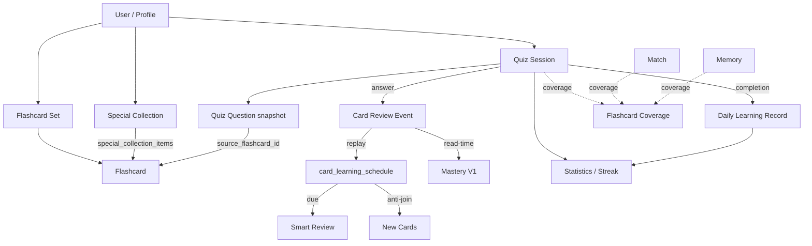

# 02 — Product & Domain

> Giải thích domain model bằng ngôn ngữ dễ hiểu. Với mỗi concept: định nghĩa, cách người dùng thấy, lưu ở đâu, business rules, quan hệ, source files.
> Glossary ngắn cho thuật ngữ: [16_GLOSSARY.md](./16_GLOSSARY.md).

## 1. User / Profile

- **Là gì:** Một tài khoản Auth (email/password). `profiles` là hồ sơ 1:1, tạo tự động bởi trigger `handle_new_user` khi user đăng ký.
- **Người dùng thấy:** Tên hiển thị, email (read-only), timezone; thấy trên app shell (avatar initials) và `/profile`.
- **Lưu ở đâu:** `auth.users` (Supabase) + `public.profiles` (`id`, `display_name`, `avatar_url`, `timezone`, `timezone_changed_at`).
- **Business rules:**
  - Không có INSERT policy cho `profiles` — chỉ trigger tạo.
  - `update_profile` RPC là đường viết duy nhất (display_name + timezone); đổi timezone cooldown 72h.
  - Timezone default `Asia/Ho_Chi_Minh`; validate theo `pg_timezone_names` (DB) + danh sách IANA (client).
- **Quan hệ:** sở hữu mọi bảng owned khác qua `user_id`.
- **Source:** `src/features/profile/`, `src/features/auth/`, `supabase/migrations/20260803215542_create_core_database.sql`, `20260806130000_profile_settings.sql`, `20260806140000_secure_profile_timezone_changes.sql`.

## 2. Flashcard

- **Là gì:** Một cặp `front` (mặt trước) / `back` (mặt sau), thuộc đúng một bộ thông thường.
- **Người dùng thấy:** Trong study session (lật thẻ), trong set detail, quiz question, match/memory tile.
- **Lưu ở đâu:** `public.flashcards` (`id`, `user_id`, `set_id`, `front`, `back`, `position`).
- **Business rules:**
  - `position` do database gán (`add_flashcard` lock set row, `max(position)+1`); client không gửi position.
  - Text: non-blank sau trim, max 50,000 ký tự.
  - Ownership composite FK `(user_id, set_id)` → `flashcard_sets(user_id, id)`.
  - Direct INSERT/UPDATE revoke; chỉ `add_flashcard` (thêm) và `UPDATE (front, back)`.
  - Xóa card để lại khoảng trống position (không renumber).
- **Quan hệ:** thuộc set; có thể nằm trong nhiều bộ đặc biệt; là nguồn của quiz question snapshot; tạo review events khi được trả lời.
- **Source:** `src/features/flashcard-sets/`, migrations `20260805120000..07110000`.

## 3. Regular flashcard set

- **Là gì:** Bộ thẻ thông thường — kết quả của một lần import (hoặc tạo tay).
- **Người dùng thấy:** `/sets` (danh sách, search, pagination, reorder), `/sets/[setId]` (chi tiết).
- **Lưu ở đâu:** `public.flashcard_sets` (`id`, `user_id`, `name`, `description`, `source_filename`, `sort_order`).
- **Business rules:**
  - Tên non-blank, ≤120 ký tự; **trùng tên được phép** (khác user hoặc import mới).
  - `sort_order` bigint: thứ tự user-owned; import mới đặt đầu danh sách; `move_flashcard_set` swap với neighbor dưới advisory lock.
  - Xóa set cascade xóa flashcards + memberships.
- **Quan hệ:** 1:N flashcards; nguồn cho quiz/study/match/memory scope.
- **Source:** `src/features/flashcard-sets/`, `20260807110000_add_flashcard_set_custom_order.sql`.

## 4. Special collection (bộ đặc biệt)

- **Là gì:** Tập hợp thẻ gom từ nhiều bộ thông thường, không copy nội dung.
- **Người dùng thấy:** `/sets?tab=special` (danh sách), `/collections/[collectionId]` (chi tiết), control “Thêm vào bộ đặc biệt” trên từng thẻ (sets detail, study session, quiz result).
- **Lưu ở đâu:** `public.special_collections` + `public.special_collection_items` (membership).
- **Business rules:**
  - Tên unique per-user, case-insensitive: unique index `(user_id, lower(name))`, ≤60 ký tự.
  - Membership PK `(collection_id, flashcard_id)`; composite FKs đảm bảo cùng user.
  - `set_card_collections(card_id, ids[])` sync idempotent (delete not-in-list + insert on-conflict do nothing); max 50 ids.
  - Sửa flashcard gốc hiển thị ở mọi collection chứa nó (vì chỉ lưu link).
- **Quan hệ:** M:N collections ↔ flashcards.
- **Source:** `src/features/special-collections/`, `20260805150000`, `20260806100000`.

## 5. Quiz session (bài kiểm tra)

- **Là gì:** Một bài trắc nghiệm do server tạo: tập câu hỏi snapshot + điểm + trạng thái.
- **Người dùng thấy:** `/quiz` (tạo), `/quiz/[sessionId]` (làm), `/quiz/[sessionId]/result` (kết quả), `/quiz?tab=history`.
- **Lưu ở đâu:** `public.quiz_sessions` (header: `mode`, `requested_question_count`, `actual_question_count`, `source_set_ids`, `source_collection_ids`, `source_all`, `origin`, `completed_at`, `correct_answer_count`) + `public.quiz_questions` (snapshot: `prompt`, `correct_answer`, `choices` jsonb, `correct_choice_index`, `selected_choice_index`, `is_correct`, `answered_at`, `flashcard_id` nullable + `source_flashcard_id`).
- **Business rules:**
  - Browser chỉ SELECT được session/questions của mình; viết qua RPC `create_quiz_session`, `submit_quiz_answer`.
  - `origin` ∈ `manual` | `smart_review` | `new_cards`, set bởi trigger từ `set_config`, immutable.
  - Snapshot bất biến: sửa/xóa flashcard gốc không đổi lịch sử quiz.
  - Strict pools (never_tested/wrong_answers) không backfill; min 1 câu (Tất cả N), max 100.
  - 2–4 choices; đáp án nhiễu unique theo normalized text; shuffled bằng MD5 ordering.
  - Resumable: question chưa trả lời đầu tiên theo `position`.
- **Quan hệ:** questions → flashcards (nullable); quiz completion ghi `card_review_events` + `daily_learning_records`; manual quiz tạo coverage session.
- **Source:** `src/features/quiz/`, `20260806110000_add_quiz_engine.sql`, `20260809120000`, `20260810120000`–`10180000`, `20260812200000`, `20260813000000`, `20260813010000`.

## 6. Quiz question (snapshot)

- **Là gì:** Một câu trong quiz; giữ nguyên prompt/choices/answer tại thời điểm tạo.
- **Business rules:** unique `(session_id, position)`, unique `(session_id, flashcard_id)`; `source_flashcard_id` bất biến kể cả khi card bị xóa; trạng thái trả lời atomic (answered_at/selected/is_correct cùng null hoặc cùng có giá trị).
- **Source:** `20260806110000`, `20260809120000`.

## 7. Card review event (lịch sử ôn tập)

- **Là gì:** Sự kiện học tập bất biến cho một thẻ (ai, thẻ nào, đúng/sai, lúc nào, nguồn).
- **Lưu ở đâu:** `public.card_review_events` (`source` ∈ quiz|study_recall|typing|cloze|smart_review; hiện chỉ `quiz` được ghi), `is_correct`, `fsrs_rating` (1–4), `quiz_session_id`/`quiz_question_id` (nullable).
- **Business rules:**
  - Append-only; không UPDATE/DELETE từ client; ghi bởi `submit_quiz_answer`.
  - `flashcard_id` **không phải FK** — giữ identity lịch sử khi card xóa.
  - Schedulable event = `fsrs_rating 1–4` OR `is_correct IS NOT NULL`.
  - Nguồn dữ liệu cho Mastery (derived) và FSRS projection (replay).
- **Source:** `20260809120000`, `20260810150000`, `20260810160000`.

## 8. Learning statistics & streak

- **Là gì:** Thống kê từ quiz đã hoàn thành: streak hiện tại/dài nhất, accuracy, active days, 30-day activity, mode breakdown, recent quizzes.
- **Người dùng thấy:** `/profile?tab=statistics`, dashboard calendar, streak indicator trên app shell.
- **Lưu ở đâu:** Không có bảng analytics; tính từ `quiz_sessions` (completed) + `daily_learning_records` qua RPC read-only `get_learning_statistics()`.
- **Business rules:**
  - Streak: một ngày = có ≥1 quiz completed trong local date đó (immutable `daily_learning_records`).
  - `daily_learning_records` snapshot local_date + timezone lúc hoàn thành; đổi timezone không rewrite.
  - Current streak: hôm nay (nếu active) hoặc hôm qua (nếu active) đếm ngược; longest = run lớn nhất.
  - Accuracy = round(correct/answered × 100).
- **Source:** `src/features/statistics/`, `20260806120000_add_learning_statistics.sql`, `20260806140000`.

## 9. Daily learning record

- **Là gì:** Một dòng bất biến cho mỗi `(user, local_date)` ghi hoạt động học.
- **Lưu ở đâu:** `public.daily_learning_records` (PK `(user_id, local_date)`, `timezone`, counts, first/last completed_at).
- **Business rules:** upsert trên completion (cộng dồn quiz_count/questions/correct); unique per local_date; không bao giờ recalculate.
- **Source:** `20260806140000`.

## 10. Mastery (V1)

- **Là gì:** Projection confidence đọc từ `card_review_events`; trạng thái: `untested` | `review` | `learning` | `strong`.
- **Người dùng thấy:** badge/color trên thẻ trong `/sets/[setId]` và `/collections/[collectionId]`, counts + legend.
- **Lưu ở đâu:** Không lưu — tính tại thời điểm đọc (read-time, replaceable).
- **Business rules:** thuật toán MASTERY_V1 (base 50, +1 correct / −1.5 incorrect, recency half-life 45d, decay 120d, review <45, strong ≥75 với ≥4 reviews). Không phải scheduler.
- **Source:** `src/features/mastery/` (đặc biệt `utils/derive-flashcard-mastery.ts`).

## 11. FSRS (spaced repetition) state

- **Là gì:** Lịch trình ôn tập theo FSRS-6 (ts-fsrs 5.4.1, config `flashlearn-v1`): `state` (0–3), `stability`, `difficulty`, `due`, `scheduled_days`, `reps`, `lapses`, ...
- **Lưu ở đâu:** `public.card_learning_schedule` — **rebuildable projection** từ `card_review_events`; chỉ ghi qua RPC CAS `upsert_card_learning_schedule` (service-role).
- **Business rules:**
  - Projection phải match số event schedulable + cursor cuối (freshness guard).
  - CAS qua `projection_revision`; retry 3 lần.
  - Rating từ quiz: correct→Good(3), incorrect→Again(1).
  - Due read: card due khi `due <= evaluationTime` (một mốc UTC cố định mỗi request); timezone profile không ảnh hưởng.
- **Quan hệ:** Smart Review dùng due read model; Dashboard đếm; New Cards dùng anti-join.
- **Source:** `src/features/spaced-repetition/`, `20260810150000`, scripts `scripts/fsrs-*.ts`.

## 12. Smart Review

- **Là gì:** Chế độ ôn tự động: lấy thẻ FSRS due (batch 10) và tạo quiz session origin `smart_review`.
- **Người dùng thấy:** Nút “Ôn ngay” trên dashboard (khi dueCount > 0), continuation “Ôn tiếp / Đã ôn xong hôm nay” trên result.
- **Business rules:**
  - Server action không nhận input từ client; derive due candidates từ `card_learning_schedule`.
  - Tạo session qua wrapper service-role `create_owned_quiz_session_from_card_ids` → `origin = smart_review`.
  - Distractor từ toàn library của user (không tạo review event cho distractor).
- **Source:** `src/features/smart-review/`, `20260810120000`–`10140000`.

## 13. New Cards (thẻ mới)

- **Là gì:** Batch các thẻ chưa từng học — “genuine New Card” = không có schedule row và không có schedulable review event.
- **Người dùng thấy:** Nút “Học thẻ mới” trên dashboard (khi count > 0), continuation trên result.
- **Business rules:** candidate từ RPC `load_new_card_candidates` (auth-scoped, `created_at ASC, id ASC`, limit ≤10); tạo session qua wrapper `create_owned_quiz_session_from_card_ids_new_cards` → origin `new_cards`; chỉ trả lời mới đưa thẻ ra khỏi New Cards.
- **Source:** `src/features/spaced-repetition/server/new-cards-repository.ts`, `20260810170000`, `20260810180000`.

## 14. Learning mode coverage (phạm vi đã luyện)

- **Là gì:** Trả lời “thẻ này đã xuất hiện trong chu kỳ hiện tại của mode X chưa?” (quiz/match/memory/runner).
- **Lưu ở đâu:** `public.flashcard_coverage` (PK `(user_id, mode, flashcard_id)`, `covered_at`) + `public.learning_coverage_sessions` (snapshot session/scope, `did_reset`).
- **Business rules:**
  - Chỉ commit khi session hoàn thành (`complete_learning_coverage_session`, idempotent, advisory lock per user+mode).
  - Khi toàn bộ thẻ còn sống trong scope đã phủ → reset (xóa) coverage của scope đó cho mode đó.
  - Strict pool “Chưa làm” = thẻ chưa có coverage row cho mode đó; “Câu sai” = wrong history từ quiz.
  - Tạo coverage session chỉ service-role.
- **Source:** `src/features/practice-coverage/`, `20260812190000`, `20260812200000`, `20260813010000`.

## 15. Study session

- **Là gì:** Phiên lật thẻ thuần túy, **không ghi history/scoring**.
- **Lưu ở đâu:** Không persist — phiên suy ra hoàn toàn từ query params (`all`, `sets`, `collections`, `seed`).
- **Business rules:** deterministic order (set_id, position, id); shuffle seeded; cap 1,000 thẻ; source cap 50; dedup by flashcard id.
- **Source:** `src/features/study/`.

## 16. Match mode

- **Là gì:** Luyện nhận diện nhanh Front→Back: ghép đúng cặp trong hai cột.
- **Business rules:** 6 cặp/batch; 12/18/24 câu; Front/Back unique sau normalize; b-matching + backtracking partition; coverage `match`; không graded.
- **Source:** `src/features/match/`.

## 17. Memory mode

- **Là gì:** Game lật thẻ: tìm cặp Front↔Back (match theo identity, không theo text).
- **Business rules:** 12 tile/batch (6 cặp); grid adaptive (2/3/4/6 cột); delay 1000ms cho đúng/sai; coverage `memory`; không graded.
- **Source:** `src/features/memory/`.

## 18. Learning mode (khái niệm chung)

- **Là gì:** Cách phân nhóm các chế độ học: “Học truyền thống” (study), “Kiểm tra” (quiz/match), “Vừa học vừa chơi” (memory/runner).
- **Filter chung:** `Chưa làm` (unseen), `Câu sai` (wrong), `Ngẫu nhiên` (random) — strict pools, không backfill.
- **Source:** `src/features/learning-modes/`.

---

## Domain relationship map

## 19. Bảng tóm tắt “dữ liệu nào từ đâu”

| Concept           | Ghi vào đâu                                                        | Tính/đọc từ đâu                            | Ai ghi                                      |
| ----------------- | ------------------------------------------------------------------ | ------------------------------------------ | ------------------------------------------- |
| Flashcard         | `flashcards`                                                       | —                                          | RPC `import_flashcard_set`, `add_flashcard` |
| Quiz session      | `quiz_sessions`                                                    | —                                          | RPC `create_quiz_session` (+ wrappers)      |
| Quiz answer       | `quiz_questions` + `card_review_events` + `daily_learning_records` | —                                          | RPC `submit_quiz_answer` (atomic)           |
| FSRS schedule     | `card_learning_schedule`                                           | replay `card_review_events`                | server (reconcile) qua CAS RPC              |
| Mastery           | —                                                                  | `card_review_events`                       | read-time                                   |
| Streak/statistics | `daily_learning_records`                                           | `quiz_sessions` + `daily_learning_records` | `submit_quiz_answer`                        |
| Coverage          | `flashcard_coverage`                                               | `learning_coverage_sessions`               | RPC `complete_learning_coverage_session`    |
