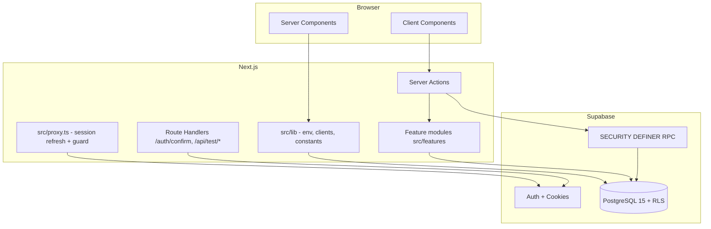
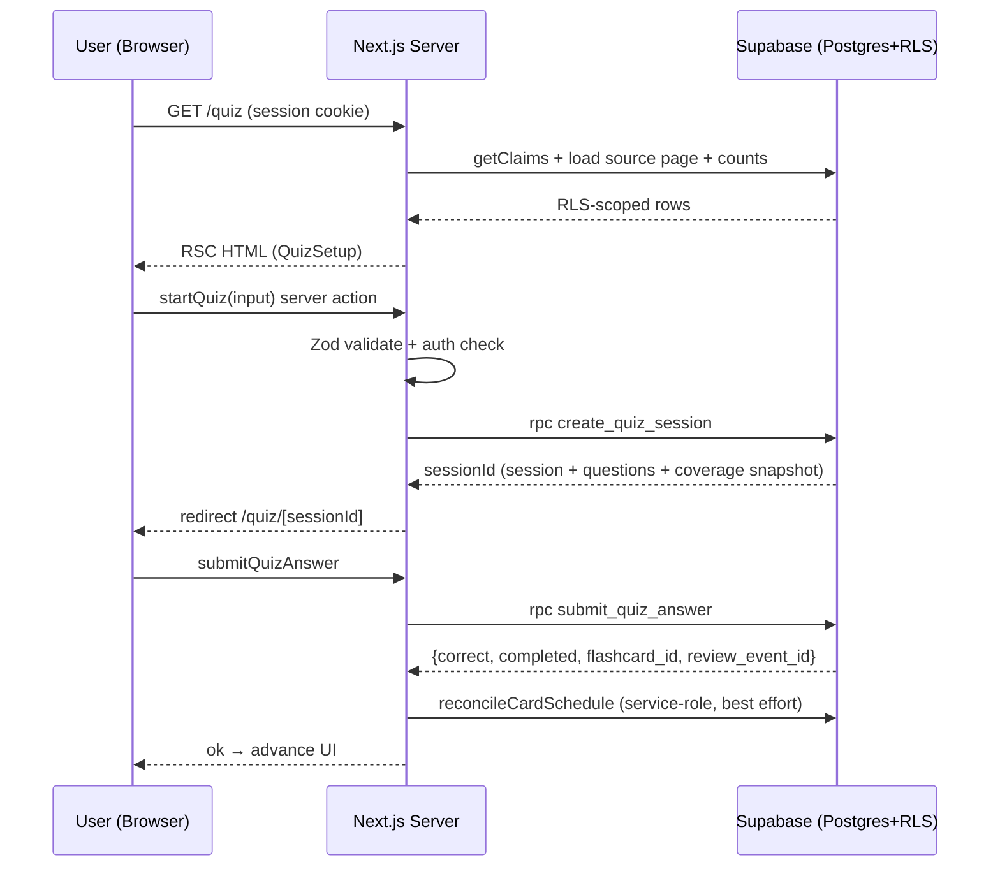
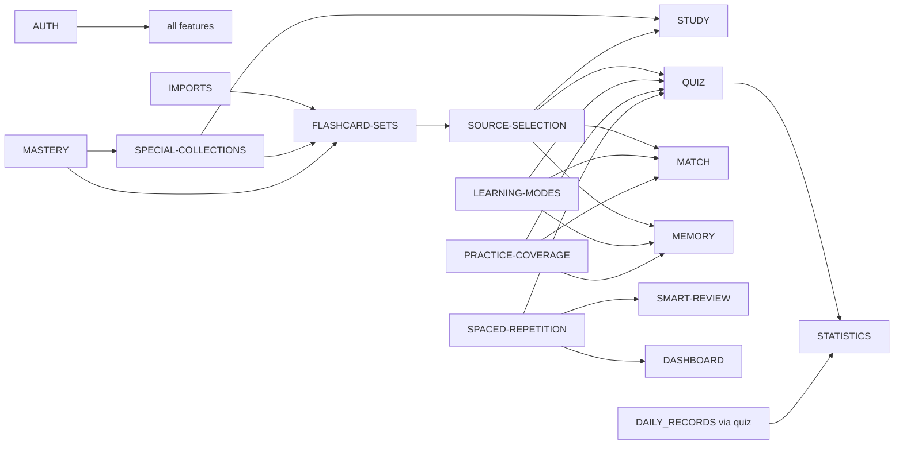

# 03 — Architecture

> Reverse-engineered từ code thực tế. Không phải bản copy `docs/ARCHITECTURE.md` (file đó thiếu các phần mới: quiz engine chi tiết, coverage, FSRS, match/memory, import mở rộng).

## 1. Architectural style

- **Feature-first:** mọi code nghiệp vụ nằm trong `src/features/<feature>/` với subfolders `components/`, `server/`, `schemas/`, `types/`, `utils/`.
- **Server-first:** Server Components mặc định; `"use client"` chỉ cho tương tác (form, flip, game state, tabs optimistic).
- **Database-as-boundary:** business rules quan trọng nằm trong PostgreSQL (constraints, composite FKs, RLS, triggers, RPC SECURITY DEFINER).
- **Supabase-backed:** Auth + PostgreSQL + RLS; browser dùng anon key, server dùng anon key (SSR) hoặc service-role (chỉ RPC private).
- **Validation at boundary:** Zod schema tại mọi server action; RPC tự validate lần nữa.
- **Deterministic logic:** shuffle seeded, MD5 ordering, b-matching, backtracking — không rải `Math.random()` trong UI.

## 2. Layers

| Layer                 | Nơi ở                                                                                           | Vai trò                             |
| --------------------- | ----------------------------------------------------------------------------------------------- | ----------------------------------- |
| Presentation          | `src/app/**/page.tsx` (RSC), `src/features/*/components/`                                       | Render, tương tác                   |
| Routing               | `src/app/(marketing)`, `(auth)`, `(app)`, `src/proxy.ts`                                        | Route groups, redirects, protection |
| Feature / Domain      | `src/features/*/utils/`, `types/`, `schemas/`                                                   | Pure logic, types, validation       |
| Server layer          | `src/features/*/server/actions.ts` (`"use server"`), `server/*.ts` (repositories/orchestrators) | Mutations, đọc dữ liệu              |
| Database access       | `src/lib/supabase/{client,server,admin,proxy}.ts`                                               | Clients                             |
| Database              | `supabase/migrations/*.sql`                                                                     | Tables, RLS, RPC, triggers          |
| Shared infrastructure | `src/lib/` (constants, env, logger, pagination, normalize-content, mutation-error)              | Cross-cutting                       |

## 3. Server vs Client boundaries

### Server Components (mặc định)

- Mọi page trong `(app)`, `(auth)`, `(marketing)`.
- Load dữ liệu bằng server supabase client (`createClient` từ `src/lib/supabase/server.ts`, `server-only`).
- Auth check trong layout: `supabase.auth.getClaims()`.

### Client Components (`"use client"`)

- Forms và interactive controls: `sign-in-form`, `sign-up` inputs, `manual-set-form`, `unified-draft-editor`, `card-collections-control`, `study-session`, `quiz-session`, `quiz-setup`, `match-*`, `memory-*`, `source-browser`, `mode-filter`, `question-count-selector`, `sticky-start-bar`, `section-tabs`, `profile-settings-form`, `dialog-overlay`, `activity-calendar-grid`, `set-reorder-list`, `start-smart-review-button`, `start-new-cards-button`, `current-user`.

### Server actions (`"use server"`)

| Feature             | File                                                                                                                                                                                      |
| ------------------- | ----------------------------------------------------------------------------------------------------------------------------------------------------------------------------------------- |
| auth                | `src/features/auth/server/actions.ts` (`signUp`, `signIn`, `signOut`)                                                                                                                     |
| imports             | `src/features/imports/server/actions.ts` (`importFlashcards`), `analyze-document.ts`, `analyze-paste.ts`, `analyze-google-sheets.ts`, `extract-document.ts`, `generate-document-cards.ts` |
| flashcard-sets      | `src/features/flashcard-sets/server/actions.ts` (rename/delete/move set, add/update/delete card)                                                                                          |
| special-collections | `src/features/special-collections/server/actions.ts`                                                                                                                                      |
| profile             | `src/features/profile/server/actions.ts` (`updateProfile`)                                                                                                                                |
| quiz                | `src/features/quiz/server/actions.ts` (`startQuiz`, `getQuizEligibility`, `submitQuizAnswer`)                                                                                             |
| study               | `src/features/study/server/actions.ts` (`getStudyCardCount`)                                                                                                                              |
| match               | `src/features/match/server/actions.ts`                                                                                                                                                    |
| memory              | `src/features/memory/server/actions.ts`                                                                                                                                                   |
| smart-review        | `src/features/smart-review/server/actions.ts` (`startSmartReview`)                                                                                                                        |
| spaced-repetition   | `src/features/spaced-repetition/server/actions.ts` (`startNewCardsLearning`)                                                                                                              |
| practice-coverage   | `src/features/practice-coverage/server/actions.ts` (`completeLearningCoverageSession`, read helpers)                                                                                      |

### Route handlers

- `src/app/auth/confirm/route.ts` — email confirmation (verifyOtp / exchangeCodeForSession).
- `src/app/api/test/classifier-count/route.ts`, `generation-count/route.ts` — test-only instrumentation, 404 khi mock env tắt.

### Browser API usage

- `current-user.tsx` dùng browser supabase client (display name/avatar).
- `study-session` dùng pointer events, keyboard, `router.replace`.
- `unified-draft-editor` dùng `crypto.randomUUID`, dnd-kit sensors.
- `activity-calendar-grid` dùng `matchMedia('(pointer: coarse)')`, portal.
- `memory-*`, `match-*` dùng timers/transition.

### Supabase clients

| Client  | File                                          | Key                              | Dùng cho                                                                                                                     |
| ------- | --------------------------------------------- | -------------------------------- | ---------------------------------------------------------------------------------------------------------------------------- |
| Browser | `src/lib/supabase/client.ts` (`"use client"`) | Publishable (anon)               | `current-user`, bất kỳ client cần auth                                                                                       |
| Server  | `src/lib/supabase/server.ts` (`server-only`)  | Publishable (anon) + SSR cookies | Server Components, server actions                                                                                            |
| Admin   | `src/lib/supabase/admin.ts` (`server-only`)   | Service role                     | RPC private: `create_owned_quiz_session_from_card_ids*`, `upsert_card_learning_schedule`, `create_learning_coverage_session` |
| Proxy   | `src/lib/supabase/proxy.ts`                   | Publishable (anon)               | `src/proxy.ts` refresh session                                                                                               |

**Rule:** không import server client vào Client Component; không dùng service-role trong browser.

## 4. Dependency direction

- `features/*` phụ thuộc `src/lib/*` (constants, env, supabase, utils) và lẫn nhau:
  - `quiz` → `practice-coverage` (eligibility/complete), `spaced-repetition` (FSRS shadow reconcile), `learning-modes`, `source-selection`, `study` (`collectStudyCardIds`).
  - `smart-review` → `spaced-repetition` (due repository), `quiz` (session), (legacy `mastery` chỉ còn trong docs).
  - `match`/`memory` → `learning-modes`, `practice-coverage`, `source-selection`.
  - `study` → `special-collections` (control), `source-selection`.
  - `statistics` → `profile` (timezone), `quiz` (sessions) — read-only.
- Shared modules được dùng nhiều: `src/lib/constants.ts`, `src/lib/mutation-error.ts` (`mapMutationError`), `src/lib/normalize-content.ts` (match/memory/quiz normalize), `src/features/learning-modes/types.ts` (`applyLearningFilter`), `src/features/source-selection/` (browser dùng chung).
- Cross-cutting concerns: auth check pattern (`getClaims`), error mapping (`mapMutationError` + feature-level), revalidatePath, RLS.

## 5. Major data flows

### Flow tổng quát (mutation)

```
UI (client) → server action ("use server") → Zod schema.safeParse
  → supabase.auth.getClaims() (auth) → supabase.rpc(...) hoặc table query (RLS)
  → PostgreSQL (trigger/constraint/RPC SECURITY DEFINER) → result
  → revalidatePath / redirect → UI
```

### Quiz flow chi tiết

```
QuizSetup (client) → getQuizEligibility → collectStudyCardIds + loadUncoveredIds + loadWrongAnswerCardIds
  → startQuiz → create_quiz_session RPC (SQL: pool, strict counts, selection, distractor, snapshot, coverage session)
  → /quiz/[sessionId] page → QuizSession (client) → submitQuizAnswer
  → submit_quiz_answer RPC (atomic: answer + review event + daily record)
  → server: reconcileCardSchedule (FSRS shadow, best-effort)
  → server: completeLearningCoverageSession (nếu manual origin)
  → /quiz/[sessionId]/result
```

### Import flow

```
ImportWizard (client) → parseWorkbook (browser) → sheet/column select
  → UnifiedDraftEditor → importFlashcards (server action) → importPayloadSchema
  → import_flashcard_set RPC (atomic set + cards) → /sets/[setId]
DocumentImport: upload → extractDocument → analyzeDocument → generateDocumentCards → editor → import
```

## 6. Architectural diagrams

### 6.1 High-level architecture



### 6.2 Request / data flow



### 6.3 Feature dependency map



## 7. Architectural hotspots (coupling cao)

| Module                                             | Lý do hotspot                                                                                                                                               |
| -------------------------------------------------- | ----------------------------------------------------------------------------------------------------------------------------------------------------------- |
| `create_quiz_session` / `submit_quiz_answer` (SQL) | Lớn, nhiều version CREATE OR REPLACE; chứa selection + distractor + snapshot + coverage; bất kỳ thay đổi nào ảnh hưởng quiz, coverage, FSRS shadow, streak. |
| `src/features/quiz/server/actions.ts`              | Orchestrate quiz + coverage + FSRS reconciliation; retry-safe.                                                                                              |
| `reconcile-orchestrator.ts` (FSRS)                 | Logic replay/CAS, retry 3, nhiều trạng thái; dùng bởi server path + scripts.                                                                                |
| `src/features/learning-modes/types.ts`             | Contract shared giữa quiz/match/memory (filters).                                                                                                           |
| `src/features/practice-coverage/server/actions.ts` | Đọc dùng chung (uncovered/wrong) + completion; quiz/match/memory phụ thuộc.                                                                                 |
| `src/features/source-selection/`                   | Browser nguồn dùng chung cho study/quiz/match/memory.                                                                                                       |
| `src/lib/supabase/types.ts`                        | Generated từ DB; phải regenerate khi schema đổi (`npm run db:types`).                                                                                       |
| `src/lib/constants.ts`                             | Mirror các limit DB (2000 rows, 50 sources, ...) — drift risk.                                                                                              |

## 8. Security posture (tóm tắt)

- RLS trên mọi bảng owned; policy SELECT/INSERT/UPDATE/DELETE theo `auth.uid()`.
- Column-limited grants + revoke direct writes; viết qua RPC scoped.
- SECURITY DEFINER RPC: `set search_path = ''`, self-validate input, non-disclosing errors (`card not found`, `set not found`).
- Service-role chỉ dùng cho RPC private (đã revoke khỏi authenticated/service_role trực tiếp ở function private).
- Local development từ chối kết nối production Supabase (trừ cờ read-only).
- Chi tiết: [06_AUTH_AND_SECURITY.md](./06_AUTH_AND_SECURITY.md).
