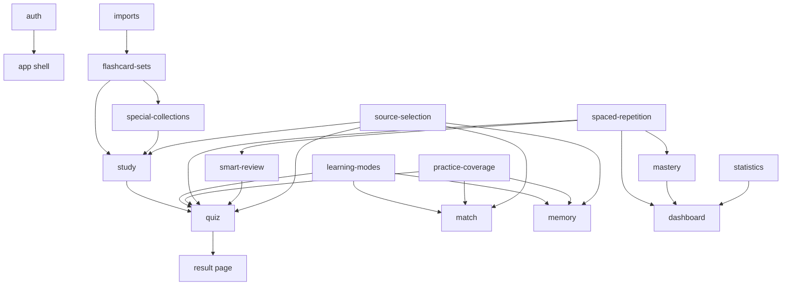

# 04. Bản đồ Codebase

> Reverse-engineered từ source code thực tế (commit `57da3a0`, branch `main`).
> Đây là "Google Maps" của repository: nơi tìm mọi thứ theo feature, và feature đó
> phụ thuộc gì. Xem thêm [SOURCE_MAP.md](./SOURCE_MAP.md) cho index concept → file.

---

## 1. Repository tree (chỉ file có vai trò kiến trúc/business)

```text
.
├── AGENTS.md                          # Blueprint gốc (một phần đã lỗi thời, xem 00_START_HERE §Documentation status)
├── README.md
├── package.json                       # scripts + dependencies (xem 12_RUNTIME_AND_DEPLOYMENT)
├── next.config.ts
├── tsconfig.json                      # strict mode
├── eslint.config.mjs                  # ESLint flat config
├── vitest.config.mts                  # Vitest + RTL config
├── playwright.config.ts               # Playwright config (webServer chạy local Supabase)
├── playwright.auth-no-confirm.config.ts
├── components.json                    # shadcn/ui config
├── .prettierrc.json
├── .husky/pre-commit                  # chạy lint-staged
├── .env.example                       # template env (xem 12_RUNTIME_AND_DEPLOYMENT)
├── src/proxy.ts                       # Next 16 proxy config cho Supabase cookie refresh
├── public/
├── src/
│   ├── app/
│   ├── components/
│   │   ├── ui/                        # primitives
│   │   ├── layout/                    # app shell, navigation
│   │   └── shared/                    # mode-tabs, section-tabs, pagination
│   ├── features/                      # 20 feature modules
│   ├── lib/
│   │   ├── supabase/                  # client, server, admin, proxy, types
│   │   ├── constants.ts               # giới hạn nghiệp vụ (dung lượng file, số thẻ…)
│   │   ├── env.ts                     # env validation khi khởi động
│   │   ├── logger.ts
│   │   ├── mutation-error.ts
│   │   ├── normalize-content.ts
│   │   ├── pagination.ts
│   │   └── utils.ts                   # cn() (tailwind-merge + clsx)
│   ├── hooks/                         # (thư mục trống — không có custom hooks dùng chung)
│   └── types/                         # (không có thư mục — types nằm trong từng feature)
├── supabase/
│   ├── migrations/                    # 23 migrations (source of truth DB)
│   ├── tests/                         # 25 file pgTAP database tests
│   ├── seed.sql
│   ├── config.toml                    # local Supabase config (port 64721-64724)
│   └── templates/confirm-email.html
├── tests/
│   ├── unit/                          # Vitest unit + component tests
│   ├── integration/                   # 7 integration tests (FSRS, coverage, mastery…)
│   ├── e2e/                           # Playwright E2E
│   ├── fixtures/
│   └── setup.ts
├── scripts/
│   ├── test-e2e-local.mjs             # E2E runner (dựng local Supabase + webServer)
│   ├── test-e2e-auth-no-confirm.mjs
│   ├── test-fsrs-local.mjs
│   ├── test-production-pdf-isolation.mjs
│   ├── test-production-pdf-worker.mjs
│   ├── block-pdf-runtime.cjs
│   ├── fsrs-reconcile-local.ts / fsrs-reconcile-production.ts
│   ├── fsrs-compare-local.ts / fsrs-compare-production.ts
│   ├── fsrs-diagnose-production.ts
│   └── lib/                            # production-identity, local-supabase-env
└── docs/
    ├── ARCHITECTURE.md, AUTH.md, DATABASE.md, QUIZ.md, STUDY.md,
    │   STATISTICS.md, IMPORT.md, LEARNING_MODES.md, ROUTES.md, DEPLOYMENT.md
    ├── DECISIONS/001-core-data-ownership.md, 002-free-tier-beta-deployment.md
    ├── QA/                              # audit reports (AUTH_*, CORE_DATABASE_AUDIT…)
    ├── work-log.md
    └── PROJECT_KNOWLEDGE/               # knowledge pack này
```

**Lưu ý thư mục trống:** `src/hooks/`, `src/types/`, `src/features/flashcards/`,
`src/features/streak/`, `src/features/analytics/` chỉ chứa `.gitkeep` — không có code.
Trong AGENTS.md blueprint, `flashcards`, `streak`, `analytics` được mô tả như feature,
nhưng implementation thực tế nằm ở nơi khác:

- CRUD flashcard → `src/features/flashcard-sets/` (server actions) + RPC `import_flashcard_set`, `add_flashcard`.
- Streak → `src/features/statistics/` (utils/streak.ts) + `daily_learning_records` + `get_learning_statistics()`.
- Analytics/statistics → `src/features/statistics/`.

---

## 2. `src/app/` — Routes (App Router)

| Route                         | File                                        | Loại component            | Ghi chú                                                           |
| ----------------------------- | ------------------------------------------- | ------------------------- | ----------------------------------------------------------------- |
| `/`                           | `(marketing)/page.tsx`                      | Server                    | Landing page                                                      |
| `/sign-in`                    | `(auth)/sign-in/page.tsx`                   | Server (wrap client form) |                                                                   |
| `/sign-up`                    | `(auth)/sign-up/page.tsx`                   | Server (wrap client form) |                                                                   |
| `/check-email`                | `check-email/page.tsx`                      | Server                    |                                                                   |
| `/auth/confirm`               | `auth/confirm/route.ts`                     | Route handler             | Xử lý email confirmation redirect                                 |
| `/auth/error`                 | `auth/error/page.tsx`                       | Server                    | Trang lỗi auth (query `error`, `error_code`, `error_description`) |
| `/api/test/classifier-count`  | `api/test/classifier-count/route.ts`        | Route handler             | Test-only: đọc count file của mock classifier                     |
| `/api/test/generation-count`  | `api/test/generation-count/route.ts`        | Route handler             | Test-only: đọc count file của mock generation                     |
| `/dashboard`                  | `(app)/dashboard/page.tsx`                  | Server                    | Tổng quan (due count, new cards, streak…)                         |
| `/import`                     | `(app)/import/page.tsx`                     | Server                    | Import wizard                                                     |
| `/sets`                       | `(app)/sets/page.tsx`                       | Server                    | Danh sách bộ + tạo bộ thủ công                                    |
| `/sets/[setId]`               | `(app)/sets/[setId]/page.tsx`               | Server                    | Chi tiết bộ, danh sách thẻ, reorder                               |
| `/collections`                | `(app)/collections/page.tsx`                | Server                    | Danh sách bộ đặc biệt                                             |
| `/collections/[collectionId]` | `(app)/collections/[collectionId]/page.tsx` | Server                    | Chi tiết bộ đặc biệt                                              |
| `/quiz`                       | `(app)/quiz/page.tsx`                       | Server                    | Quiz setup (source + filter + số câu)                             |
| `/quiz/[sessionId]`           | `(app)/quiz/[sessionId]/page.tsx`           | Server                    | Quiz session                                                      |
| `/quiz/[sessionId]/result`    | `(app)/quiz/[sessionId]/result/page.tsx`    | Server                    | Kết quả + thêm vào collection                                     |
| `/study`                      | `(app)/study/page.tsx`                      | Server                    | Study source selection                                            |
| `/study/session`              | `(app)/study/session/page.tsx`              | Server                    | Study session                                                     |
| `/match`                      | `(app)/match/page.tsx`                      | Server                    | Match setup                                                       |
| `/match/session`              | `(app)/match/session/page.tsx`              | Server                    | Match session                                                     |
| `/memory`                     | `(app)/memory/page.tsx`                     | Server                    | Memory setup                                                      |
| `/memory/session`             | `(app)/memory/session/page.tsx`             | Server                    | Memory session                                                    |
| `/history`                    | `(app)/history/page.tsx`                    | Server                    | Lịch sử quiz                                                      |
| `/statistics`                 | `(app)/statistics/page.tsx`                 | Server                    | Thống kê + streak + calendar                                      |
| `/profile`                    | `(app)/profile/page.tsx`                    | Server                    | Hồ sơ + timezone                                                  |
| `/settings`                   | `(app)/settings/page.tsx`                   | Server                    | Settings                                                          |

Các layout:

- `src/app/layout.tsx` — root layout, font, globals.
- `src/app/(app)/layout.tsx` — authenticated shell (sidebar/bottom nav, profile fetch).
- `src/app/(auth)/layout.tsx` — auth pages layout.
- `src/app/error.tsx`, `src/app/not-found.tsx`.

**So với AGENTS.md route map:** route `/study/[sessionId]` trong blueprint đã đổi thành
`/study/session` (không có id trong URL); `/quiz/[attemptId]` → `/quiz/[sessionId]`;
không có `/statistics` riêng cho streak như mô tả chi tiết — streak nằm trong `/statistics`.
Route `/history`, `/profile`, `/settings` tồn tại như blueprint.

---

## 3. `src/features/` — Feature modules

Quy ước feature-first: mỗi feature có `components/`, `server/`, `utils/`, `schemas/`, `types/`
(tùy nhu cầu). Không có barrel `index.ts` chuẩn nào; import trực tiếp theo path.

### 3.1 `auth/`

- **Purpose:** Đăng nhập/đăng ký/đăng xuất, xử lý session.
- **Entry/UI:** `components/sign-in-form.tsx`, `components/sign-up-error-display.tsx`, `components/current-user.tsx`, `components/sign-out-button.tsx`.
- **Server logic:** `server/actions.ts` — `signIn`, `signUp`, `signOut` server actions.
- **Validation:** `schemas/auth-schema.ts` (Zod).
- **Utils:** `utils/routes.ts` (route sau auth), `utils/auth-error.ts` (map lỗi → message), `utils/safe-redirect.ts`.
- **Database:** `auth.users`, `profiles` (trigger `handle_new_user`).
- **Tests:** `tests/unit/features/auth/`, E2E `tests/e2e/auth.spec.ts`, `auth-no-confirm.spec.ts`.
- **Dependencies:** `lib/supabase/server.ts`, `lib/env.ts`.

### 3.2 `imports/`

- **Purpose:** Import flashcard từ Excel, CSV, paste text, Google Sheets, PDF, DOCX.
- **Entry/UI:** `components/import-wizard.tsx`, `components/unified-draft-editor.tsx`.
- **Server logic:**
  - `server/actions.ts` — `importFlashcards` (RPC `import_flashcard_set`).
  - `server/analyze-document.ts`, `server/extract-document.ts`, `server/generate-document-cards.ts` — luồng AI document import.
  - `server/analyze-paste.ts` — semantic paste analysis (Gemini).
  - `server/analyze-google-sheets.ts` — Google Sheets import.
- **Adapters:** `adapters/excel-adapter.ts`, `pdf-adapter.ts`, `docx-adapter.ts`, `paste-adapter.ts`, `google-sheets-adapter.ts`, `gemini-provider.ts`, `gemini-classifier.ts`, `gemini-retry-policy.ts`.
- **Utils:** `utils/parse-workbook.ts`, `parse-paste.ts`, `document-classifier.ts`, `section-builder.ts`, `sheets-parser.ts`, `detect-columns.ts`, `normalize-import-row.ts`, `validate-draft-cards.ts`, `public-sheets.ts`, `sheets-a1.ts`.
- **Validation:** `schemas/import-schema.ts`, `types/import-types.ts`, `types/document-types.ts`.
- **Database:** RPC `import_flashcard_set`.
- **Tests:** `tests/unit/features/imports/`, E2E `paste-import.spec.ts`, `document-import.spec.ts`, `document-auto-detection.spec.ts`, `unified-editor.spec.ts`, `pdf-runtime-isolation.spec.ts`.
- **Dependencies:** `lib/supabase/server.ts`, Gemini API (server-side, `GEMINI_API_KEY`), Google Picker API (browser, `NEXT_PUBLIC_GOOGLE_*`).

### 3.3 `flashcard-sets/`

- **Purpose:** CRUD bộ thông thường, flashcard, reorder bộ.
- **Entry/UI:** `components/manual-set-form.tsx`, `components/set-reorder-list.tsx`.
- **Server logic:** `server/actions.ts` — tạo/sửa/xóa bộ, add/edit/delete flashcard, `moveFlashcardSet`.
- **Validation:** `schemas/set-schema.ts`.
- **Utils:** `utils/search.ts`.
- **Database:** `flashcard_sets`, `flashcards`, RPC `import_flashcard_set`, `add_flashcard`, `move_flashcard_set`.
- **Tests:** `tests/unit/features/flashcard-sets/`, E2E `set-management.spec.ts`, `manual-set-creation.spec.ts`, `flashcard-set-ordering.spec.ts`.
- **Dependencies:** `lib/supabase/server.ts`, `lib/normalize-content.ts`.

### 3.4 `special-collections/`

- **Purpose:** Bộ đặc biệt (gom thẻ từ nhiều bộ), gắn thẻ vào collection.
- **Entry/UI:** `components/card-collections-control.tsx`.
- **Server logic:** `server/actions.ts` — tạo collection (RPC `create_special_collection`), `setCardCollections` (RPC `set_card_collections`).
- **Validation:** `schemas/collection-schema.ts`.
- **Database:** `special_collections`, `special_collection_items`.
- **Tests:** `tests/unit/features/special-collections/`, E2E `special-collections.spec.ts`, `quiz-result-collections.spec.ts`.
- **Dependencies:** `lib/supabase/server.ts`.

### 3.5 `study/`

- **Purpose:** Chế độ học flashcard (lật thẻ, shuffle).
- **Entry/UI:** `components/study-session.tsx`, `components/study-source-select.tsx`.
- **Server logic:** `server/actions.ts` (`getStudyCardCount`), `server/load-study-cards.ts` (`collectStudyCardIds` — dùng chung bởi quiz eligibility), `server/load-study-session.ts`.
- **Utils:** `utils/merge-cards.ts`, `utils/shuffle.ts`.
- **Validation:** `schemas/study-schema.ts`.
- **Database:** `flashcards`, `flashcard_sets`, `special_collection_items` (read).
- **Tests:** `tests/unit/features/study/`, E2E `study-mode.spec.ts`.
- **Dependencies:** `flashcard-sets`, `special-collections`, `lib/supabase/server.ts`.

### 3.6 `quiz/`

- **Purpose:** Quiz engine (tạo đề, làm bài, nộp bài, kết quả).
- **Entry/UI:** `components/quiz-setup.tsx`, `components/quiz-session.tsx`.
- **Server logic:** `server/actions.ts` — `startQuiz`, `getQuizEligibility`, `submitQuizAnswer` (gọi RPC `create_quiz_session`, `submit_quiz_answer`; sau đó shadow FSRS reconcile + complete coverage).
- **Validation:** `schemas/quiz-schema.ts` (Zod: `quizStartSchema`, `answerSchema`, `quizEligibilitySchema`, `QuizMode` union).
- **Utils:** `utils/quiz-session-origin.ts`, `utils/result-collection-targets.ts`.
- **Database:** `quiz_sessions`, `quiz_questions`, RPC `create_quiz_session`, `submit_quiz_answer`, `create_learning_coverage_session`, `complete_learning_coverage_session`; bảng coverage.
- **Tests:** `tests/unit/features/quiz/`, integration FSRS, E2E `quiz-advancement.spec.ts`, `quiz-result-collections.spec.ts`, `learning-mode-setup.spec.ts`.
- **Dependencies:** `spaced-repetition` (reconcile), `practice-coverage` (coverage), `study` (collectStudyCardIds), `learning-modes` (filter mapping), `special-collections`.

### 3.7 `study` → xem 3.5.

### 3.8 `smart-review/`

- **Purpose:** Phiên ôn thẻ đến hạn (FSRS due), gói trong quiz session origin `smart_review`.
- **Entry/UI:** `components/start-smart-review-button.tsx`, `components/smart-review-continuation.tsx`.
- **Server logic:** `server/actions.ts` — `startSmartReview` (load due candidates → RPC `create_owned_quiz_session_from_card_ids` qua admin client).
- **Utils:** `utils/smart-review-session.ts` (SMART_REVIEW_BATCH_SIZE=10, `smartReviewTargetCardIds`), `utils/smart-review-result.ts`.
- **Database:** `card_learning_schedule` (due read), RPC `create_owned_quiz_session_from_card_ids` (service_role only).
- **Tests:** `tests/unit/features/smart-review/`, E2E `smart-review.spec.ts`.
- **Dependencies:** `spaced-repetition`, `quiz`, `lib/supabase/admin.ts`.

### 3.9 `spaced-repetition/`

- **Purpose:** FSRS-6 scheduling (ts-fsrs 5.4.1), projection reconcile, due repository, new cards.
- **Config:** `config.ts` — frozen `flashlearn-v1` parameters (weights, retention 0.9, learning steps 1m/10m…). **INVARIANT:** đổi tham số phải đổi parameter-set id.
- **Server logic:**
  - `server/reconcile-card-schedule.ts` — reconcile một card (repo pattern + writer qua admin client RPC `upsert_card_learning_schedule`).
  - `server/reconcile-orchestrator.ts` — thuật toán replay events → FSRS state (CAS, idempotent).
  - `server/schedule-repository.ts`, `server/service-role-repository.ts`, `server/due-repository.ts` (`countDueCards`, `findDueCandidates`, `loadDueCandidateResult`), `server/new-cards-repository.ts`.
  - `server/actions.ts` — dashboard due/new counts.
- **Utils:** `utils/rating-map.ts` (incorrect→Again, correct→Good), `utils/retrievability.ts`, `utils/due-candidates.ts`, `utils/decide-replay-strategy.ts`.
- **Types:** `types/spaced-repetition-types.ts`, `due-types.ts`, `reconciliation-types.ts`.
- **Database:** `card_learning_schedule` (projection), `card_review_events` (immutable events), RPC `upsert_card_learning_schedule` (service_role only), `load_new_card_candidates` (authenticated).
- **Tests:** `tests/unit/features/spaced-repetition/`, integration (`fsrs-*.integration.test.ts`), scripts `scripts/fsrs-*.ts`.
- **Dependencies:** `lib/supabase/admin.ts`, `lib/supabase/server.ts`, `ts-fsrs`.

### 3.10 `mastery/`

- **Purpose:** Derive mastery (thành thạo thẻ) từ review history; snapshot cho dashboard.
- **Server logic:** `server/load-card-masteries.ts`, `server/load-mastery-snapshot.ts`, `server/load-mastery-aggregate.ts`.
- **Utils:** `utils/derive-flashcard-mastery.ts`, `utils/aggregate-mastery.ts`, `utils/find-active-card-ids.ts`, `utils/select-smart-review-candidates.ts`.
- **Presentation:** `presentation/mastery-presentation.ts`.
- **Types:** `types/mastery-types.ts`.
- **Database:** `card_review_events` (read), `flashcards` (read).
- **Tests:** `tests/unit/features/mastery/`, integration `mastery-snapshot-completeness.integration.test.ts`, E2E `mastery-summary.spec.ts`, `mastery-visuals.spec.ts`.
- **Dependencies:** `spaced-repetition` types, `study` utils.

### 3.11 `practice-coverage/`

- **Purpose:** Coverage theo mode (quiz/match/memory/runner): thẻ nào đã "làm" trong cycle hiện tại; hỗ trợ filter Chưa làm / Câu sai.
- **Server logic:** `server/actions.ts` — `loadUncoveredIds`, `loadWrongAnswerCardIds`, `completeLearningCoverageSession`.
- **Database:** `flashcard_coverage`, `learning_coverage_sessions`, RPC `complete_learning_coverage_session`.
- **Tests:** `tests/unit/features/practice-coverage/`.
- **Dependencies:** `lib/supabase/server.ts`. Được dùng bởi quiz, match, memory.

### 3.12 `source-selection/`

- **Purpose:** Chọn nguồn (tất cả / bộ thường / bộ đặc biệt) cho quiz & learning modes.
- **Entry/UI:** `components/source-browser.tsx`.
- **Server logic:** `server/load-source-page.ts`.
- **Types:** `types/source-types.ts`.
- **Tests:** `tests/unit/features/source-selection/`, E2E `source-selection-scale.spec.ts`.
- **Dependencies:** `flashcard-sets`, `special-collections`.

### 3.13 `learning-modes/`

- **Purpose:** Shared UI/logic cho 3 filter `unseen/wrong/random` và chọn số câu cho quiz/match/memory.
- **Components:** `components/mode-filter.tsx`, `components/question-count-selector.tsx`, `components/sticky-start-bar.tsx`.
- **Logic:** `types.ts` — `learningFilters`, `learningFilterToQuizMode`, `applyLearningFilter` (strict pool, không backfill), message helpers.
- **Tests:** `tests/unit/features/learning-modes/`, E2E `learning-mode-setup.spec.ts`.
- **Dependencies:** `quiz` (QuizMode type).

### 3.14 `match/`

- **Purpose:** Trò chơi Match (ghép cặp front/back).
- **Entry/UI:** `components/match-setup.tsx`, `components/match-session.tsx`, `components/match-board.tsx`.
- **Server logic:** `server/actions.ts` — `getMatchAvailability`, `startMatchCoverageSession` (build session → RPC `create_learning_coverage_session` qua admin).
- **Utils:** `utils/match-session.ts` (build batches, seeded random), `utils/match-state.ts`, `utils/match-normalize.ts`.
- **Validation:** `schemas/match-schema.ts`.
- **Types:** `types/match-types.ts`.
- **Database:** read flashcards; RPC `create_learning_coverage_session` (admin), `complete_learning_coverage_session`.
- **Tests:** `tests/unit/features/match/`, E2E `match.spec.ts`.
- **Dependencies:** `learning-modes`, `practice-coverage`, `source-selection`, `lib/supabase/admin.ts`.

### 3.15 `memory/`

- **Purpose:** Trò chơi Memory (lật ô nhớ vị trí).
- **Entry/UI:** `components/memory-session.tsx`.
- **Server logic:** `server/actions.ts` — `getMemoryAvailability`, `startMemoryCoverageSession` (giống pattern match).
- **Utils:** `utils/memory-session.ts`, `utils/memory-state.ts`, `utils/memory-grid-layout.ts`.
- **Validation:** `schemas/memory-schema.ts`.
- **Types:** `types/memory-types.ts`.
- **Database:** như match (coverage sessions, mode `memory`).
- **Tests:** `tests/unit/features/memory/`, E2E `memory.spec.ts`.
- **Dependencies:** `learning-modes`, `practice-coverage`, `lib/supabase/admin.ts`.

### 3.16 `statistics/`

- **Purpose:** Thống kê học tập, streak, activity calendar.
- **Server logic:** `server/load-statistics.ts` (gọi RPC `get_learning_statistics`).
- **Utils:** `utils/streak.ts` (tính streak từ records — pure), `utils/month-activity.ts`, `utils/streak-label.ts`.
- **Components:** `components/statistics-panel.tsx`, `components/activity-calendar-grid.tsx`, `components/month-activity-calendar.tsx`, `components/streak-indicator.tsx`.
- **Database:** RPC `get_learning_statistics`, `daily_learning_records` (read).
- **Tests:** `tests/unit/features/statistics/`, E2E `statistics` liên quan (`activity-calendar.spec.ts`).
- **Dependencies:** `lib/supabase/server.ts`.

### 3.17 `profile/`

- **Purpose:** Hồ sơ người dùng, timezone, display name.
- **Entry/UI:** `components/profile-settings-form.tsx`.
- **Server logic:** `server/actions.ts` (gọi RPC `update_profile`), `server/load-profile.ts`.
- **Validation:** `schemas/profile-schema.ts` (timezone phải có trong `constants/timezones.ts`).
- **Database:** `profiles`, RPC `update_profile`.
- **Tests:** `tests/unit/features/profile/`, E2E `profile-settings.spec.ts`.
- **Dependencies:** `lib/supabase/server.ts`.

### 3.18 `dashboard/`

- **Purpose:** Dashboard status (due/new counts, streak, greeting).
- **Components:** `components/dashboard-learning-status.tsx`.
- **Database:** đọc `card_learning_schedule` due count, `load_new_card_candidates`, statistics.
- **Tests:** `tests/unit/features/dashboard/`.
- **Dependencies:** `spaced-repetition`, `statistics`, `mastery`.

---

## 4. `src/components/`

| Thư mục                                                                         | Vai trò                                                                                                |
| ------------------------------------------------------------------------------- | ------------------------------------------------------------------------------------------------------ |
| `ui/button.tsx`, `input.tsx`, `label.tsx`, `textarea.tsx`, `dialog-overlay.tsx` | Primitives (shadcn-style, c-v-a). Danh sách nhỏ — không phải toàn bộ shadcn/ui.                        |
| `layout/app-shell.tsx`                                                          | Shell authenticated (sidebar desktop + bottom nav mobile, chứa `<AppNavigation/>` + `<CurrentUser/>`). |
| `layout/app-navigation.tsx`                                                     | Điều hướng chính.                                                                                      |
| `layout/nav-items.ts`                                                           | Danh sách nav items.                                                                                   |
| `layout/placeholder-page.tsx`                                                   | Placeholder cho route chưa xây.                                                                        |
| `shared/mode-tabs.tsx`                                                          | Tabs chọn mode.                                                                                        |
| `shared/section-tabs.tsx`                                                       | Tabs phân đoạn.                                                                                        |
| `shared/pagination-controls.tsx`                                                | Phân trang.                                                                                            |

Không có `components/ui` hoàn chỉnh của shadcn (không có dialog.tsx, select.tsx riêng…).
Xem [10_UI_DESIGN_SYSTEM.md](./10_UI_DESIGN_SYSTEM.md).

---

## 5. `src/lib/`

| File                             | Vai trò                                                                                                                                     |
| -------------------------------- | ------------------------------------------------------------------------------------------------------------------------------------------- |
| `supabase/client.ts`             | Browser client (từ `@supabase/ssr`) — dùng trong Client Components.                                                                         |
| `supabase/server.ts`             | Server client (từ `@supabase/ssr`, cookie-based) — Server Components/actions.                                                               |
| `supabase/admin.ts`              | Admin client (service role key) — **chỉ dùng server-side cho RPC trusted** (reconcile FSRS, create coverage session, smart review wrapper). |
| `supabase/proxy.ts`              | Update session cookies trong proxy.                                                                                                         |
| `supabase/production-project.ts` | Chặn dùng production project từ local (an toàn dev).                                                                                        |
| `supabase/types.ts`              | Generated database types (sinh bởi `npm run db:types`).                                                                                     |
| `env.ts`                         | Validate env khi khởi động (Zod) — fail fast.                                                                                               |
| `constants.ts`                   | Hằng số nghiệp vụ (dung lượng file, giới hạn hàng…).                                                                                        |
| `logger.ts`                      | Logger server.                                                                                                                              |
| `mutation-error.ts`              | Helper lỗi mutation.                                                                                                                        |
| `normalize-content.ts`           | Chuẩn hóa nội dung flashcard (trim, newline…).                                                                                              |
| `pagination.ts`                  | Helper phân trang.                                                                                                                          |
| `utils.ts`                       | `cn()` helper.                                                                                                                              |

---

## 6. `supabase/`

| Thư mục                        | Vai trò                                                                                            |
| ------------------------------ | -------------------------------------------------------------------------------------------------- |
| `migrations/`                  | 23 migrations — **source of truth database** (xem 05_DATABASE.md).                                 |
| `tests/`                       | 25 file pgTAP tests (chạy `npm run db:test` với local Supabase).                                   |
| `seed.sql`                     | Seed dev data.                                                                                     |
| `config.toml`                  | Local Supabase config: Postgres 15, ports 64721–64724, auth email confirmations bật, storage 5MiB. |
| `templates/confirm-email.html` | Template email xác nhận.                                                                           |

---

## 7. `tests/`

| Thư mục        | Vai trò                                                                                                                                  |
| -------------- | ---------------------------------------------------------------------------------------------------------------------------------------- |
| `unit/`        | Vitest: `features/` (theo feature), `app/`, `components/`, `lib/`.                                                                       |
| `integration/` | 7 integration tests: FSRS (due read, shadow quiz, reconciliation, direct-due cutover), mastery snapshot, new cards, card-scope mismatch. |
| `e2e/`         | Playwright: 30+ spec files, `support/` (auth helpers, supabase API, local endpoints).                                                    |
| `fixtures/`    | Dữ liệu mẫu.                                                                                                                             |
| `setup.ts`     | Vitest setup (jest-dom).                                                                                                                 |

Chi tiết map test theo feature: [11_TESTING_AND_QA.md](./11_TESTING_AND_QA.md).

---

## 8. `scripts/`

| Script                                                                | Vai trò                                                                               |
| --------------------------------------------------------------------- | ------------------------------------------------------------------------------------- |
| `test-e2e-local.mjs`                                                  | Runner E2E local (dựng Supabase local, chạy migrations, seed, webServer, Playwright). |
| `test-e2e-auth-no-confirm.mjs`                                        | E2E với auth không confirm email.                                                     |
| `test-fsrs-local.mjs`                                                 | Test FSRS local.                                                                      |
| `test-production-pdf-isolation.mjs`, `test-production-pdf-worker.mjs` | Verify PDF runtime isolation trên production.                                         |
| `block-pdf-runtime.cjs`                                               | Chặn pdf-parse runtime ngoài worker (bảo mật).                                        |
| `fsrs-reconcile-local.ts` / `fsrs-reconcile-production.ts`            | Reconcile projection toàn bộ.                                                         |
| `fsrs-compare-local.ts` / `fsrs-compare-production.ts`                | So sánh projection vs replay.                                                         |
| `fsrs-diagnose-production.ts`                                         | Diagnose FSRS production.                                                             |
| `lib/production-identity.ts`                                          | Allowlist project ref production (fail closed).                                       |
| `lib/local-supabase-env.mjs`                                          | Env cho local Supabase.                                                               |

---

## 9. Feature dependency matrix

| Feature             | Depends on                                                                       | Used by                                      | Tables/RPC chính                                                        |
| ------------------- | -------------------------------------------------------------------------------- | -------------------------------------------- | ----------------------------------------------------------------------- |
| auth                | lib/supabase                                                                     | tất cả                                       | `auth.users`, `profiles`                                                |
| imports             | lib/supabase, Gemini API, Google Picker                                          | —                                            | RPC `import_flashcard_set`                                              |
| flashcard-sets      | lib/supabase                                                                     | study, quiz, source-selection, match, memory | `flashcard_sets`, `flashcards`                                          |
| special-collections | lib/supabase                                                                     | study, quiz, source-selection                | `special_collections`, `special_collection_items`                       |
| study               | flashcard-sets, special-collections                                              | quiz (`collectStudyCardIds`)                 | read tables                                                             |
| quiz                | study, learning-modes, practice-coverage, spaced-repetition, special-collections | —                                            | `quiz_sessions`, `quiz_questions`, coverage                             |
| smart-review        | spaced-repetition, quiz                                                          | —                                            | `card_learning_schedule`, RPC `create_owned_quiz_session_from_card_ids` |
| spaced-repetition   | lib/supabase (admin)                                                             | quiz, smart-review, dashboard, mastery       | `card_review_events`, `card_learning_schedule`                          |
| mastery             | spaced-repetition                                                                | dashboard                                    | read `card_review_events`                                               |
| practice-coverage   | lib/supabase                                                                     | quiz, match, memory                          | `flashcard_coverage`, `learning_coverage_sessions`                      |
| learning-modes      | quiz (types)                                                                     | quiz, match, memory                          | —                                                                       |
| match               | learning-modes, practice-coverage, source-selection                              | —                                            | coverage (mode `match`)                                                 |
| memory              | learning-modes, practice-coverage, source-selection                              | —                                            | coverage (mode `memory`)                                                |
| statistics          | lib/supabase                                                                     | dashboard                                    | RPC `get_learning_statistics`, `daily_learning_records`                 |
| profile             | lib/supabase                                                                     | layout                                       | `profiles`, RPC `update_profile`                                        |
| dashboard           | spaced-repetition, statistics, mastery                                           | —                                            | due counts, new cards                                                   |
| source-selection    | flashcard-sets, special-collections                                              | quiz, match, memory, study                   | read tables                                                             |

**Điểm nóng (hotspot):** `practice-coverage` + `spaced-repetition` + `quiz` là cụm coupling cao
nhất — quiz gọi coverage completion và FSRS reconcile sau mỗi câu trả lời.
`collectStudyCardIds` (study) là hàm dùng chung xuyên suốt (quiz eligibility, study count).

---

## 10. Mermaid: feature dependency graph



---

## 11. Nơi tìm: câu trả lời nhanh

| Câu hỏi                      | Đọc ở đâu                                                                                                                                        |
| ---------------------------- | ------------------------------------------------------------------------------------------------------------------------------------------------ |
| Quiz được tạo thế nào?       | `src/features/quiz/server/actions.ts` + `supabase/migrations/20260813010000_harden_strict_quiz_session_creation.sql` (RPC `create_quiz_session`) |
| Quiz được chấm điểm thế nào? | `supabase/migrations/20260810160000_populate_fsrs_rating_on_answer.sql` (RPC `submit_quiz_answer`)                                               |
| FSRS state ở đâu?            | `src/features/spaced-repetition/` + `card_learning_schedule` + RPC `upsert_card_learning_schedule`                                               |
| Streak tính thế nào?         | `src/features/statistics/utils/streak.ts` + RPC `get_learning_statistics` + `daily_learning_records`                                             |
| Import file thế nào?         | `src/features/imports/` + RPC `import_flashcard_set`                                                                                             |
| Auth thế nào?                | `(app)/layout.tsx` (guard), `src/features/auth/`, `src/lib/supabase/*`, `src/proxy.ts`                                                           |
| RLS thế nào?                 | `supabase/migrations/20260803215542_create_core_database.sql` và các migration sau                                                               |
| Match/Memory thế nào?        | `src/features/match/`, `src/features/memory/`                                                                                                    |
| Coverage thế nào?            | `src/features/practice-coverage/` + `flashcard_coverage` + `learning_coverage_sessions`                                                          |
| Mastery thế nào?             | `src/features/mastery/`                                                                                                                          |
