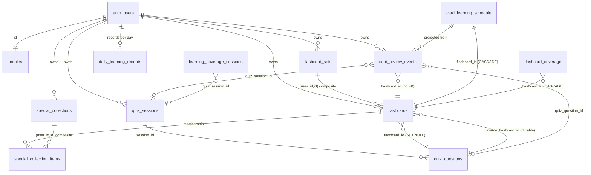

# 05. Database Reference

> Reverse-engineered từ `supabase/migrations/` (source of truth), 23 migrations tính đến
> commit `57da3a0`. Nếu tài liệu khác migrations, migrations là đúng.
> Các kiểm tra: `supabase/tests/` (pgTAP) và `npm run db:test`.

---

## 1. Bảng hiện tại (13 bảng)

Tất cả bảng user-owned đều có `user_id` (hoặc ownership qua composite FK) và RLS.

| Bảng                         | Mục đích                                          |
| ---------------------------- | ------------------------------------------------- |
| `profiles`                   | Hồ sơ người dùng (display name, timezone)         |
| `flashcard_sets`             | Bộ flashcard thông thường                         |
| `flashcards`                 | Thẻ (front/back) thuộc một bộ                     |
| `special_collections`        | Bộ đặc biệt                                       |
| `special_collection_items`   | Membership thẻ ↔ bộ đặc biệt                      |
| `quiz_sessions`              | Phiên quiz (snapshot source + kết quả)            |
| `quiz_questions`             | Câu hỏi trong phiên (snapshot)                    |
| `card_review_events`         | Sự kiện ôn tập bất biến (immutable event log)     |
| `card_learning_schedule`     | Projection FSRS-6 (rebuildable)                   |
| `flashcard_coverage`         | Coverage theo (user, mode, flashcard)             |
| `learning_coverage_sessions` | Snapshot server-created cho completion idempotent |
| `daily_learning_records`     | Ghi nhận ngày học (streak)                        |

Không có bảng `quiz_attempts` / `quiz_attempt_items` / `flashcard_learning_stats` như
AGENTS.md mô tả — naming đã đổi thành `quiz_sessions`/`quiz_questions`/`card_review_events`.
Xem [00_START_HERE.md §Documentation status](./00_START_HERE.md).

---

## 2. Chi tiết từng bảng

### `profiles`

- PK: `id uuid` → `auth.users(id)` ON DELETE CASCADE.
- Columns: `display_name text` (null hoặc trimmed, ≤100), `avatar_url text` (≤500),
  `timezone text NOT NULL DEFAULT 'Asia/Ho_Chi_Minh'` (≤64), `created_at`, `updated_at`.
- RLS: enabled. Policies: `profiles_select_own`, `profiles_update_own`.
- Tạo bởi trigger `handle_new_user()` sau khi sign up (không có INSERT policy cho client).
- Mutation qua RPC `update_profile(display_name, timezone)` — kiểm tra timezone hợp lệ,
  đổi timezone không được phép thay đổi ngày activity (xem migration 20260806140000).

### `flashcard_sets`

- PK: `id uuid default gen_random_uuid()`.
- Columns: `user_id uuid NOT NULL → auth.users ON DELETE CASCADE`, `name text NOT NULL`
  (trimmed, ≤120), `description text` (≤500), `source_filename text` (≤255),
  `created_at`, `updated_at`.
- **Unique: `(user_id, id)`** — composite key dùng làm target của FK ownership flashcards.
- RLS: `flashcard_sets_{select,insert,update,delete}_own` (user_id = auth.uid()).
- **Ghi chú hardening:** migration 20260805140000 revoke quyền update toàn cột;
  chỉ `grant update (name, description, source_filename)` cho authenticated.

### `flashcards`

- PK: `id uuid`.
- Columns: `user_id NOT NULL`, `set_id uuid NOT NULL`, `front text NOT NULL` (trimmed, ≤50000),
  `back text NOT NULL` (≤50000), `position integer NOT NULL DEFAULT 0` (≥0), timestamps.
- **FK composite:** `(user_id, set_id) → flashcard_sets(user_id, id) ON DELETE CASCADE`.
- **Unique:** `(user_id, id)`.
- RLS: `flashcards_{select,insert,update,delete}_own`.
- Hardening: chỉ `grant update (front, back, position)` — không cho client đổi `set_id`/`user_id`
  trực tiếp (migration 20260805140000).
- Index: `idx_flashcards_user_created_at_id (user_id, created_at, id)` (hỗ trợ New Cards).

### `special_collections`

- PK: `id uuid`.
- Columns: `user_id NOT NULL`, `name text NOT NULL` (trimmed, ≤60), `icon text` (≤32),
  `color text` (≤32), timestamps.
- **Unique index: `idx_special_collections_user_name ON (user_id, lower(name))`** — tên
  không trùng (case-insensitive) trong phạm vi user.
- RLS: select/insert/update/delete own.
- Tạo mới bắt buộc qua RPC `create_special_collection(name, icon, color)` (security definer,
  derive `auth.uid()`). Update chỉ cho `(name, icon, color)`.

### `special_collection_items`

- PK: `(collection_id, flashcard_id)`.
- Columns: `user_id NOT NULL`, `created_at`.
- **FK composite kép:** `(user_id, collection_id) → special_collections(user_id, id) CASCADE`
  và `(user_id, flashcard_id) → flashcards(user_id, id) CASCADE`.
  → Cross-user membership bị chặn ở tầng database, không chỉ RLS.
- RLS: select/insert/delete own. **Không có UPDATE policy.**
- Sửa membership qua RPC `set_card_collections(card_id, collection_ids[])` (validate ownership).

### `quiz_sessions`

- PK: `id uuid`.
- Columns: `user_id NOT NULL`, `mode text` check (`balanced`, `never_tested`,
  `wrong_answers`, `pure_random`), `requested_question_count int` (1–100 — bản cuối
  migration 20260813010000; migration cũ giới hạn 10–100),
  `actual_question_count int` (1–100), `source_set_ids uuid[]`, `source_collection_ids uuid[]`,
  `source_all boolean DEFAULT false`, `origin text NOT NULL DEFAULT 'manual'`
  check (`manual`, `smart_review`, `new_cards`), `started_at`, `completed_at` (null cho đến khi xong),
  `correct_answer_count int` (0..actual), check `completed_at >= started_at`.
- RLS: `quiz_sessions_select_own` (read only — writes qua RPC).
- **Trigger `quiz_sessions_set_origin`:** INSERT lấy origin từ `current_setting('flashlearn.quiz_session_origin')`
  (mặc định `manual`); UPDATE không cho đổi origin (immutable).
- `requested_question_count` luôn = `actual_question_count` (strict — migration 20260813000000/10000).

### `quiz_questions`

- PK: `id uuid`.
- Columns: `session_id uuid NOT NULL → quiz_sessions ON DELETE CASCADE`, `user_id NOT NULL`,
  `position int` (≥0), `flashcard_id uuid → flashcards ON DELETE SET NULL` (link sống),
  `source_flashcard_id uuid` (id bất biến — giữ khi thẻ gốc bị xóa), `prompt text NOT NULL`,
  `correct_answer text NOT NULL`, `choices jsonb` (array 2–4 phần tử),
  `correct_choice_index int` (0–3), `selected_choice_index int` (null), `is_correct boolean` (null),
  `answered_at timestamptz` (null).
- **Unique:** `(session_id, position)`, `(session_id, flashcard_id)`.
- Check toàn vẹn: `answered_at`/`selected_choice_index`/`is_correct` null hoặc cùng non-null.
- RLS: `quiz_questions_select_own`. Writes chỉ qua RPC.
- Câu hỏi là **snapshot**: sửa flashcard gốc không ảnh hưởng câu đã tạo.

### `card_review_events` (immutable event log)

- PK: `id uuid`.
- Columns: `user_id NOT NULL`, `flashcard_id uuid NOT NULL` (**không phải FK** — thẻ có thể
  bị xóa, history vẫn còn), `source text` check (`quiz`, `study_recall`, `typing`, `cloze`,
  `smart_review`), `is_correct boolean`, `fsrs_rating smallint` (null hoặc 1–4: Again/Hard/Good/Easy),
  `reviewed_at timestamptz NOT NULL`, `quiz_session_id uuid → quiz_sessions ON DELETE SET NULL`,
  `quiz_question_id uuid UNIQUE → quiz_questions ON DELETE SET NULL`.
- Check: nếu `source = 'quiz'` thì phải có `is_correct`, `quiz_session_id`, `quiz_question_id`;
  nếu khác thì ba cột đó phải null.
- RLS: select own. **Không INSERT/UPDATE/DELETE cho client** — chỉ service_role (qua RPC/trigger).
- Ghi bởi: RPC `submit_quiz_answer` (source `quiz`) và các luồng review khác.
- `fsrs_rating` chỉ do server tính (không nhận từ client), gắn trong cùng insert.

### `card_learning_schedule` (FSRS projection)

- PK: `id uuid`.
- Columns: `user_id NOT NULL`, `flashcard_id NOT NULL → flashcards ON DELETE CASCADE`,
  **FSRS-6 state**: `state smallint` (0–3), `stability double precision` (≥0), `difficulty` (≥0),
  `due timestamptz`, `scheduled_days` (≥0), `learning_steps int` (≥0), `reps int` (≥0),
  `lapses int` (≥0), `last_review timestamptz`.
- **Projection cursor:** `projection_revision bigint` (≥0, optimistic concurrency),
  `processed_event_count bigint` (≥1), `last_processed_reviewed_at`, `last_processed_review_event_id`.
- **Frozen scheduler identity:** `algorithm` (`fsrs-6`), `implementation` (`ts-fsrs@5.4.1`),
  `parameter_set` (`flashlearn-v1`).
- **Unique:** `(user_id, flashcard_id)`.
- RLS: select own. **Không INSERT/UPDATE/DELETE trực tiếp** — chỉ RPC
  `upsert_card_learning_schedule` (service_role only) với CAS + idempotency.
- Comment chính thức: "Rebuildable FSRS-6 projection. Authoritative source: card_review_events."
- Index: `idx_card_learning_schedule_user_due (user_id, due, flashcard_id)`.

### `flashcard_coverage`

- PK: `(user_id, mode, flashcard_id)`.
- Columns: `mode text` check (`quiz`, `match`, `memory`, `runner`), `covered_at` default now().
- RLS: select/insert/delete own (insert check ownership qua subquery flashcards).
- **Client chỉ có SELECT** từ migration 20260812200000 (revoke insert/delete/update) —
  ghi coverage chỉ qua RPC `complete_learning_coverage_session`.
- Index: `idx_flashcard_coverage_user_mode (user_id, mode)`.

### `learning_coverage_sessions`

- PK: `id uuid`.
- Columns: `user_id NOT NULL`, `mode text` (như trên), `session_card_ids uuid[]`,
  `scope_card_ids uuid[]` (cardinality > 0), `quiz_session_id uuid UNIQUE → quiz_sessions
ON DELETE CASCADE` (chỉ cho mode `quiz`), `completed_at timestamptz`, `did_reset boolean`,
  `created_at`.
- RLS: select own. **Client chỉ SELECT** — tạo qua RPC `create_learning_coverage_session`
  (service_role only), hoàn tất qua RPC `complete_learning_coverage_session` (authenticated).
- Index: `(user_id, mode, created_at desc)`.

### `daily_learning_records`

- PK: `(user_id, local_date)`.
- Columns: `timezone text` (1–64), `completed_quiz_count int` (>0), `questions_answered int` (≥0),
  `correct_answers int` (≥0), `first_completed_at`, `last_completed_at`.
- Check: `last_completed_at >= first_completed_at`, `correct_answers <= questions_answered`.
- Ghi bởi RPC `submit_quiz_answer` khi hoàn thành quiz (upsert theo `user_id + local_date`).
- Index: `(user_id, local_date desc)`.

---

## 3. Entity relationship (Mermaid ER)

---

## 4. RLS tổng hợp

| Bảng                         | RLS | SELECT | INSERT               | UPDATE                                     | DELETE  | Ghi chú           |
| ---------------------------- | --- | ------ | -------------------- | ------------------------------------------ | ------- | ----------------- |
| `profiles`                   | ✅  | own    | — (trigger auth)     | own                                        | —       |                   |
| `flashcard_sets`             | ✅  | own    | own                  | own (chỉ name/description/source_filename) | own     |                   |
| `flashcards`                 | ✅  | own    | own                  | own (chỉ front/back/position)              | own     |                   |
| `special_collections`        | ✅  | own    | qua RPC              | own (chỉ name/icon/color)                  | own     |                   |
| `special_collection_items`   | ✅  | own    | qua RPC              | —                                          | qua RPC |                   |
| `quiz_sessions`              | ✅  | own    | qua RPC              | —                                          | —       |                   |
| `quiz_questions`             | ✅  | own    | qua RPC              | —                                          | —       |                   |
| `card_review_events`         | ✅  | own    | — (server)           | —                                          | —       | service_role full |
| `card_learning_schedule`     | ✅  | own    | — (RPC service_role) | —                                          | —       | service_role full |
| `flashcard_coverage`         | ✅  | own    | qua RPC              | —                                          | qua RPC |                   |
| `learning_coverage_sessions` | ✅  | own    | — (RPC service_role) | —                                          | —       |                   |
| `daily_learning_records`     | ✅  | own    | — (RPC)              | —                                          | —       |                   |

Nguyên tắc: **client không bao giờ ghi trực tiếp bảng sự kiện/projection/coverage**;
mọi write nghiệp vụ đi qua RPC security definer (derive `auth.uid()`) hoặc service_role.

---

## 5. Functions / RPC

### 5.1 Authenticated (client gọi được)

| RPC                                  | Input                                              | Output                                                           | Mục đích                                                                  | Migration                                                |
| ------------------------------------ | -------------------------------------------------- | ---------------------------------------------------------------- | ------------------------------------------------------------------------- | -------------------------------------------------------- |
| `create_quiz_session`                | mode, set_ids, collection_ids, all, question_count | uuid (session id)                                                | Tạo quiz: strict pool, sinh câu hỏi + distractor, tạo coverage session    | 20260806110000 → … → 20260813010000 (bản cuối)           |
| `submit_quiz_answer`                 | question_id, selected_choice_index                 | session_id, is_correct, completed, flashcard_id, review_event_id | Chấm câu, ghi review event + fsrs_rating, hoàn tất session + daily record | 20260809120000 → 20260810160000 (bản cuối)               |
| `get_learning_statistics`            | —                                                  | jsonb (streak, mode breakdown, recent quizzes…)                  | Thống kê đọc                                                              | 20260806120000 → 20260806140000 (bản cuối)               |
| `update_profile`                     | display_name, timezone                             | —                                                                | Cập nhật profile (kiểm tra timezone, bảo vệ activity date)                | 20260806130000 → 20260806140000 (bản cuối)               |
| `import_flashcard_set`               | name, cards jsonb                                  | set_id                                                           | Import atomic (transaction)                                               | 20260805120000 → 20260807110000 (bản cuối, gán position) |
| `add_flashcard`                      | set_id, front, back                                | —                                                                | Thêm thẻ vào bộ                                                           | 20260805130000                                           |
| `move_flashcard_set`                 | set_id, direction                                  | —                                                                | Reorder bộ                                                                | 20260807110000                                           |
| `create_special_collection`          | name, icon, color                                  | uuid                                                             | Tạo bộ đặc biệt (unique tên CI)                                           | 20260805150000                                           |
| `set_card_collections`               | card_id, collection_ids[]                          | —                                                                | Gắn/gỡ thẻ khỏi bộ đặc biệt                                               | 20260805150000 → 20260806100000 (bản cuối)               |
| `complete_learning_coverage_session` | session_id                                         | completed_at, did_reset                                          | Hoàn tất coverage cycle (insert coverage + có thể reset)                  | 20260812200000                                           |
| `load_new_card_candidates`           | limit (default 10)                                 | total, flashcard_id, created_at                                  | Thẻ chưa từng học (anti-join schedule + events)                           | 20260810180000                                           |

### 5.2 Service-role only (server trust boundary)

| RPC                                                 | Input                                                            | Output            | Mục đích                                                             | Migration                       |
| --------------------------------------------------- | ---------------------------------------------------------------- | ----------------- | -------------------------------------------------------------------- | ------------------------------- |
| `create_owned_quiz_session_from_card_ids`           | user_id, card_ids[]                                              | uuid              | Tạo quiz từ danh sách thẻ (Smart Review) — set origin `smart_review` | 20260810130000 → 20260810140000 |
| `create_owned_quiz_session_from_card_ids_new_cards` | user_id, card_ids[]                                              | uuid              | Tạo quiz từ danh sách thẻ (New Cards) — set origin `new_cards`       | 20260810170000                  |
| `upsert_card_learning_schedule`                     | ~17 tham số projection                                           | bigint (revision) | Ghi projection FSRS với CAS + freshness guard + idempotent           | 20260810150000                  |
| `create_learning_coverage_session`                  | user_id, mode, session_card_ids, scope_card_ids, quiz_session_id | uuid              | Tạo snapshot coverage                                                | 20260812200000                  |

### 5.3 Hệ thống / trigger

| Function                    | Mục đích                                                               |
| --------------------------- | ---------------------------------------------------------------------- |
| `handle_new_user()`         | Trigger sau INSERT `auth.users` → tạo `profiles` row.                  |
| `set_updated_at()`          | Trigger cập nhật `updated_at` trên các bảng.                           |
| `set_quiz_session_origin()` | Trigger quiz_sessions: set origin từ session setting; chặn sửa origin. |

---

## 6. Trigger tổng hợp

| Trigger                    | Bảng                                 | Khi           | Tác dụng                                  |
| -------------------------- | ------------------------------------ | ------------- | ----------------------------------------- |
| `handle_new_user`          | auth.users (after insert)            | sign up       | Tạo profiles row                          |
| `set_updated_at`           | nhiều bảng (before update)           | update        | Cập nhật `updated_at`                     |
| `quiz_sessions_set_origin` | quiz_sessions (before insert/update) | insert/update | Set origin (mặc định `manual`), immutable |

Không có trigger tự động ghi card_review_events khi sửa flashcard — events chỉ ghi tại
thời điểm trả lời qua RPC (fsrs_rating được populate trong cùng insert, xem
migration 20260810160000 dùng trigger? — thực tế fsrs_rating được tính trong RPC `submit_quiz_answer`
trước khi insert event; migration mô tả "populate atomically inside the immutable insert").

---

## 7. Database invariants (bắt buộc giữ)

1. **Ownership mọi nơi:** mọi bảng user-owned có `user_id` hoặc composite FK dẫn về
   user; ownership luôn từ `auth.uid()`/server, không bao giờ từ client input.
2. **Quiz là snapshot:** `quiz_questions` lưu prompt/correct_answer/choices độc lập;
   `source_flashcard_id` giữ identity khi thẻ bị xóa. Sửa thẻ không đổi lịch sử quiz.
3. **`requested_question_count == actual_question_count`** — strict, không backfill,
   fail closed nếu pool đổi giữa chừng (advisory lock `user:quiz`).
4. **Distractor không trùng:** sau khi normalize (lower + trim + collapse space),
   `choices` không được trùng; cần ≥2 back khác nhau trong scope để tạo đề.
5. **Events bất biến:** `card_review_events` không update/delete từ client;
   chỉ append. Projection rebuild được từ events + frozen config.
6. **Projection CAS:** `upsert_card_learning_schedule` từ chối ghi stale
   (revision, event count, final event id/time phải khớp); idempotent khi lặp chính xác.
7. **FSRS config frozen:** đổi tham số (weights, retention, steps…) phải đổi
   `parameter_set` (`flashlearn-v1` bất biến) — kẻo projection không rebuild được.
8. **Streak theo local date:** ngày học tính bằng timezone của profile (fallback
   `Asia/Ho_Chi_Minh`); `daily_learning_records` PK `(user_id, local_date)`; đổi timezone
   không được làm mất/đổi ngày activity (migration 20260806140000).
9. **Coverage chỉ ghi khi hoàn tất:** `flashcard_coverage` chỉ qua
   `complete_learning_coverage_session`; reset (did_reset) khi scope đã cover toàn bộ —
   serialize bằng advisory lock `user:mode`.
10. **New Cards là read model:** "mới" = không có schedule row + không có event
    schedulable; tính trong SQL (`load_new_card_candidates`), không materialize client.
11. **Smart Review / New Cards không tạo coverage quiz session:** chỉ quiz origin `manual`
    tham gia coverage mode `quiz`.
12. **Tên bộ đặc biệt unique CI per user.**
13. **Cascade xóa:** xóa user/set/flashcard/collection cascade đúng chain
    (flashcards → quiz_questions SET NULL qua flashcard_id; events giữ nguyên id).
14. **Quiz question trả lời 1 lần + retry idempotent:** row lock `for update` trên
    question+session; nếu đã trả lời, retry cùng đáp án → trả về sự kiện immutable đã có
    (không đổi gì); retry đáp án khác → "question not found".

---

## 8. Migration history timeline

| Migration                                             | Thay đổi domain chính                                                                                             |
| ----------------------------------------------------- | ----------------------------------------------------------------------------------------------------------------- |
| `20260803215542_create_core_database`                 | Core: profiles, flashcard_sets, flashcards, special_collections, special_collection_items + RLS + handle_new_user |
| `20260805120000_add_atomic_flashcard_import`          | RPC `import_flashcard_set` (atomic transaction)                                                                   |
| `20260805130000_add_flashcard_to_set`                 | RPC `add_flashcard`                                                                                               |
| `20260805140000_restrict_flashcard_mutation_columns`  | Giới hạn cột update flashcards/sets                                                                               |
| `20260805150000_special_collections_memberships`      | RPC create/set_card_collections, revoke quyền thô                                                                 |
| `20260806100000_validate_collection_membership_input` | Validate input membership                                                                                         |
| `20260806110000_add_quiz_engine`                      | quiz_sessions, quiz_questions, create_quiz_session, submit_quiz_answer                                            |
| `20260806120000_add_learning_statistics`              | get_learning_statistics (RPC đọc)                                                                                 |
| `20260806130000_profile_settings`                     | update_profile, timezone                                                                                          |
| `20260806140000_secure_profile_timezone_changes`      | Hardening timezone + submit_quiz_answer ghi daily_learning_records                                                |
| `20260807110000_add_flashcard_set_custom_order`       | position + move_flashcard_set; import gán position                                                                |
| `20260809120000_add_card_review_events`               | Event log + source_flashcard_id + backfill + submit_quiz_answer ghi event                                         |
| `20260810120000_add_explicit_quiz_card_sessions`      | create_quiz_session_from_card_ids                                                                                 |
| `20260810130000_secure_explicit_quiz_card_sessions`   | Wrapper owned (security definer)                                                                                  |
| `20260810140000_add_quiz_session_origin`              | origin column + trigger + smart_review wrapper                                                                    |
| `20260810150000_add_fsrs_schedule_projection`         | card_learning_schedule + fsrs_rating column + upsert RPC                                                          |
| `20260810160000_populate_fsrs_rating_on_answer`       | submit_quiz_answer trả flashcard_id/review_event_id; fsrs_rating trong insert                                     |
| `20260810170000_add_new_cards_origin`                 | New Cards origin + wrapper                                                                                        |
| `20260810180000_harden_new_cards_read_model`          | Indexes + load_new_card_candidates                                                                                |
| `20260812190000_add_learning_coverage`                | flashcard_coverage                                                                                                |
| `20260812200000_make_learning_coverage_session_safe`  | learning_coverage_sessions + RPC create/complete + revoke client coverage writes                                  |
| `20260813000000_strict_quiz_eligibility`              | Strict pool (không backfill) cho never_tested/wrong_answers                                                       |
| `20260813010000_harden_strict_quiz_session_creation`  | Advisory lock + fail-closed count guard                                                                           |

Quy tắc: không sửa migration đã apply; thêm migration mới. `supabase/tests/*.sql`
kiểm chứng từng migration theo số thứ tự.

---

## 9. Data lifecycle

| Sự kiện                     | Điều gì xảy ra                                                                                                                                                                                                                                           |
| --------------------------- | -------------------------------------------------------------------------------------------------------------------------------------------------------------------------------------------------------------------------------------------------------- |
| **User tạo**                | Trigger `handle_new_user` → profiles row (timezone mặc định `Asia/Ho_Chi_Minh`).                                                                                                                                                                         |
| **Set tạo**                 | RPC/INSERT → flashcard_sets (owner = auth.uid()).                                                                                                                                                                                                        |
| **Flashcard tạo**           | RPC `add_flashcard` / `import_flashcard_set` → flashcards (position gán tự động).                                                                                                                                                                        |
| **Flashcard xóa**           | flashcards row xóa; quiz_questions.flashcard_id → SET NULL (snapshot giữ qua source_flashcard_id); card_review_events giữ id (không FK); card_learning_schedule → CASCADE xóa; special_collection_items → CASCADE xóa; flashcard_coverage → CASCADE xóa. |
| **Collection xóa**          | special_collection_items của collection → CASCADE xóa. Thẻ không bị xóa.                                                                                                                                                                                 |
| **Quiz hoàn thành**         | submit_quiz_answer câu cuối → session.completed_at set; daily_learning_records upsert (local date); events đã ghi từng câu; coverage completion (nếu origin manual) → flashcard_coverage insert + có thể reset.                                          |
| **Quiz bỏ dở**              | Session chưa completed không tính streak/stats; events của các câu đã trả lời vẫn ghi (đúng theo thiết kế event log).                                                                                                                                    |
| **Smart Review hoàn thành** | Quiz origin `smart_review`; không có coverage quiz session; events vẫn ghi; stats quiz vẫn cộng.                                                                                                                                                         |
| **User xóa**                | Cascade xóa toàn bộ dữ liệu user (auth.users ON DELETE CASCADE).                                                                                                                                                                                         |
