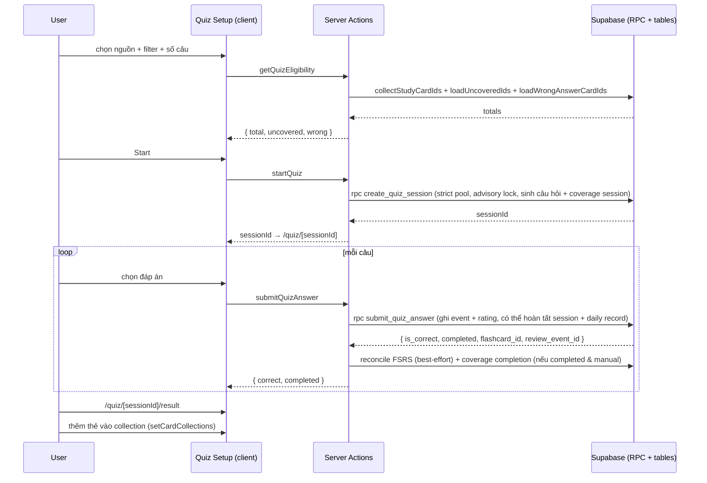

# 08. User Flows

> Luồng end-to-end chính. Mỗi luồng: user steps, UI route, components, server functions,
> database operations, validations quan trọng, failure cases.

---

## 1. Authentication flow

```
Visitor → /sign-up hoặc /sign-in → Supabase Auth → session cookie → (app) app
```

**Steps:**

1. Visitor mở landing `/`.
2. `/sign-in` hoặc `/sign-up` (server component render client form).
3. `signUp`/`signIn` server action (`src/features/auth/server/actions.ts`):
   - Zod validate (`schemas/auth-schema.ts`).
   - Gọi Supabase auth; lỗi map qua `utils/auth-error.ts`.
   - Redirect an toàn theo `next` (`utils/safe-redirect.ts`).
4. Nếu email confirm bật → `/check-email`; bấm link → `/auth/confirm` (route handler) → set session.
5. `(app)/layout.tsx` kiểm tra session server-side; chưa đăng nhập → redirect.
6. Trigger `handle_new_user()` tạo `profiles`.

**Failure cases:** email đã tồn tại (23505), mật khẩu yếu, session hết hạn →
redirect `/auth/error` hoặc message inline.

---

## 2. Import flow (Excel / CSV / Paste / Google Sheets / PDF / DOCX)

```
File/paste → parse (client) → sheet/column mapping → normalize → preview + validate
→ confirm → server action → RPC import_flashcard_set → bộ mới
```

**Steps:**

1. `/import` → wizard (`import-wizard.tsx`).
2. Chọn nguồn:
   - File: parse bằng adapter (excel/csv) → workbook → chọn sheet → detect cột → preview.
   - Paste: `analyze-paste.ts` — cấu trúc (TSV, Q:/A:) parse trực tiếp; văn bản liên tục
     qua Gemini (nếu có `GEMINI_API_KEY`).
   - Google Sheets: Picker browser → `analyze-google-sheets.ts` → sheets-parser.
   - PDF/DOCX: `extract-document.ts` → `document-classifier.ts` → `section-builder.ts`
     → `generate-document-cards.ts` (Gemini) → draft cards.
3. `unified-draft-editor.tsx`: xem/sửa các thẻ draft trước khi lưu.
4. Xác nhận → `importFlashcards` server action:
   - Zod `importPayloadSchema`.
   - Auth check.
   - RPC `import_flashcard_set(name, cards jsonb)` — atomic transaction, gán position.
   - `revalidatePath('/sets')`.
5. Redirect `/sets`.

**Validations:** extension + size limit (`lib/constants.ts`), normalize (trim/newline),
bỏ hàng trống, đánh dấu trùng chính xác, server re-validate, RPC validate name/length.

**Failure cases:** file sai định dạng, thiếu cột, không đủ thẻ hợp lệ, Gemini fail
(retry policy), session hết hạn. Không lưu file gốc.

---

## 3. Study flow

```
/study → chọn nguồn → getStudyCardCount → /study/session → lật thẻ → xong
```

**Steps:**

1. `/study` → `study-source-select.tsx` chọn set/collection.
2. `getStudyCardCount` server action → `collectStudyCardIds` (dedupe theo id).
3. `/study/session` → `study-session.tsx` load thẻ (`load-study-session.ts`).
4. Lật thẻ (front/back), prev/next, shuffle (`utils/shuffle.ts`, `utils/merge-cards.ts`).

**State:** client (index, flipped, shuffled list). Không ghi DB khi học.

**Failure cases:** nguồn rỗng, session hết hạn.

---

## 4. Quiz flow

```
/quiz → chọn nguồn + filter + số câu → getQuizEligibility → startQuiz (RPC create_quiz_session)
→ /quiz/[sessionId] làm bài → submitQuizAnswer (RPC submit_quiz_answer + FSRS reconcile + coverage)
→ /quiz/[sessionId]/result → thêm thẻ vào collection
```

**Steps:**

1. `/quiz` → `quiz-setup.tsx`: `source-browser.tsx` chọn nguồn (tất cả/set/collection),
   `mode-filter.tsx` chọn filter, `question-count-selector.tsx` chọn số câu.
2. `getQuizEligibility` → `collectStudyCardIds` + `loadUncoveredIds("quiz")` +
   `loadWrongAnswerCardIds` → hiển thị "Tất cả N" và cap số câu (10–50/100; min 10).
3. Start → `startQuiz` → RPC `create_quiz_session`:
   - Validate scope ownership + strict pool (never_tested/wrong không backfill).
   - Advisory lock `user:quiz`.
   - Sinh câu hỏi (snapshot) + distractor (3, dedupe normalized) + shuffle.
   - Fail closed nếu thiếu thẻ/câu.
   - Tạo `learning_coverage_sessions` (mode quiz).
4. `/quiz/[sessionId]` → `quiz-session.tsx` (1 câu/lần, 4 đáp án, feedback đúng/sai).
5. `submitQuizAnswer` → RPC `submit_quiz_answer`:
   - Row lock; ghi selected/is_correct/answered_at; ghi `card_review_events` +
     fsrs_rating (correct→3, wrong→1).
   - Câu cuối: set completed_at, `correct_answer_count`, upsert `daily_learning_records`
     (local date theo timezone).
   - Server action sau đó: shadow FSRS reconcile (best-effort); coverage completion
     (chỉ origin `manual`).
6. Kết quả: `/quiz/[sessionId]/result` — điểm, đúng/sai từng câu, nút thêm vào collection
   (`quiz-result-collections.spec.ts`).

**Validations:** `quizStartSchema`/`answerSchema` (Zod; questionCount 1–100, hằng số UI
`QUIZ_MIN_QUESTIONS=10`/`QUIZ_MAX_QUESTIONS=100`), RPC bounds (mode, 1–100,
scope ≤50 sources, all exclusive), đáp án trong 0–3, question chưa trả lời.

**Failure cases:** không đủ thẻ → UI hiển thị message và không start; session hết hạn;
retry submit cùng đáp án → idempotent (không đổi); đổi đáp án sau khi trả lời → lỗi.

---

## 5. Smart Review flow

```
Dashboard "Ôn thẻ" → startSmartReview (server, không input client)
→ load due candidates (batch 10) → RPC create_owned_quiz_session_from_card_ids (admin, origin smart_review)
→ quiz session thường
```

**Steps:**

1. Nút trên dashboard → `startSmartReview` server action.
2. `loadDueCandidateResult` (scope library, due ≤ now, limit 10).
3. RPC service-role `create_owned_quiz_session_from_card_ids(user_id, card_ids)` —
   set origin `smart_review`, tạo session qua `create_quiz_session_from_card_ids`.
4. Redirect tới quiz session; làm bài như quiz thường.
5. Không có coverage quiz session; events/stats vẫn ghi.

**Failure cases:** không còn thẻ due → `{ ok: true, empty: true }` → UI "Không còn thẻ cần ôn";
admin RPC fail → generic error.

---

## 6. Match flow

```
/match → chọn nguồn + filter + số câu → getMatchAvailability
→ startMatchCoverageSession (build session + coverage session) → /match/session chơi
→ completeLearningCoverageSession khi xong
```

**Steps:**

1. `/match` → `match-setup.tsx` (source + filter + số câu).
2. `getMatchAvailability` → load cards + `applyLearningFilter` + `getMatchEligibility`.
3. `startMatchCoverageSession`: build batches (seeded random từ `node:crypto`),
   RPC admin `create_learning_coverage_session` (mode `match`) → redirect `/match/session`.
4. `match-session.tsx` + `match-board.tsx`: ghép cặp.
5. Hoàn tất → `completeLearningCoverageSession` → coverage ghi (có thể reset).

**Constraints:** số câu phải trong availableCounts; strict pool cho unseen/wrong.

---

## 7. Memory flow

Giống Match: `/memory` → `memory-session.tsx` (grid, lật ô, tìm cặp) → hoàn tất →
coverage mode `memory`.

---

## 8. New Cards flow

```
Dashboard "Chưa học" → start new cards → RPC create_owned_quiz_session_from_card_ids_new_cards
→ quiz session
```

- Đọc `load_new_card_candidates` (thẻ không schedule + không event schedulable).
- Tạo quiz session origin qua wrapper New Cards (service-role).

---

## 9. Sequence diagram tổng hợp (Quiz)


